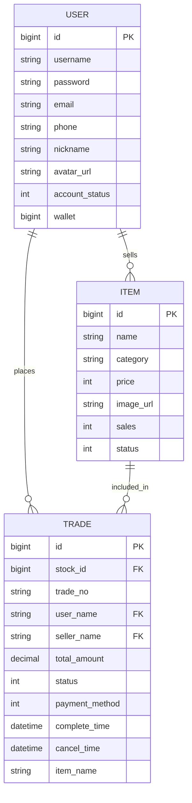

# 1. 数据库结构与关系

## 1.1 概述

本章节将深入分析电商平台项目的数据库结构，包括表结构设计、实体关系、索引策略以及多数据源配置等方面。通过对数据库结构的全面了解，可以更好地理解系统的数据流转和业务逻辑实现。

## 1.2 数据库表结构分析

首先，我们需要查询并分析系统中的所有数据表。根据微服务架构，每个服务可能有自己独立的数据库或数据表。

### 1.2.1 用户服务数据表

从用户服务的实体类分析，我们可以推断以下数据表结构：

#### 用户表 (user)

| 字段名 | 数据类型 | 说明 | 约束 |
|--------|----------|------|------|
| id | BIGINT | 主键ID | PRIMARY KEY, AUTO_INCREMENT |
| username | VARCHAR(50) | 用户名 | NOT NULL, UNIQUE |
| password | VARCHAR(100) | 密码哈希值 | NOT NULL |
| email | VARCHAR(100) | 邮箱地址 | UNIQUE |
| phone | VARCHAR(20) | 手机号码 | UNIQUE |
| nickname | VARCHAR(50) | 昵称 | |
| avatar_url | VARCHAR(255) | 头像URL | |
| account_status | TINYINT | 用户状态（0：正常，1：禁用） | DEFAULT 0 |
| wallet | BIGINT | 钱包余额 | DEFAULT 0 |
| created_user | BIGINT | 创建人 | |
| updated_user | BIGINT | 更新人 | |
| created_time | DATETIME | 创建时间 | |
| updated_time | DATETIME | 更新时间 | |

### 1.2.2 商品服务数据表

从商品服务的实体类分析，我们可以推断以下数据表结构：

#### 商品表 (item)

| 字段名 | 数据类型 | 说明 | 约束 |
|--------|----------|------|------|
| id | BIGINT | 主键 | PRIMARY KEY, AUTO_INCREMENT |
| name | VARCHAR(100) | 商品名称 | NOT NULL |
| category | VARCHAR(50) | 商品分类 | |
| price | INT | 商品价格 | NOT NULL |
| image_url | VARCHAR(255) | 商品图片 | |
| sales | INT | 商品销量 | DEFAULT 0 |
| status | TINYINT | 商品状态 | |
| create_time | DATETIME | 创建时间 | |
| update_time | DATETIME | 更新时间 | |
| create_uesr | INT | 创建人 | |
| update_user | INT | 更新人 | |

### 1.2.3 交易服务数据表

从交易服务的实体类分析，我们可以推断以下数据表结构：

#### 订单表 (trade)

| 字段名 | 数据类型 | 说明 | 约束 |
|--------|----------|------|------|
| id | BIGINT | 订单ID | PRIMARY KEY, AUTO_INCREMENT |
| stock_id | BIGINT | 商品ID | |
| trade_no | VARCHAR(50) | 订单编号 | NOT NULL, UNIQUE |
| user_name | VARCHAR(50) | 买家ID | |
| seller_name | VARCHAR(50) | 卖家ID | |
| total_amount | DECIMAL(10,2) | 订单总金额 | |
| status | TINYINT | 订单状态 | |
| payment_method | TINYINT | 支付方式 | |
| complete_time | DATETIME | 完成时间 | |
| cancel_time | DATETIME | 取消时间 | |
| item_name | VARCHAR(100) | 商品名称 | |
| cancel_reason | VARCHAR(255) | 取消原因 | |
| create_time | DATETIME | 创建时间 | |

## 1.3 实体关系图 (ERD)

以下是系统主要实体之间的关系图：



## 1.4 数据库索引策略分析

根据业务特点和查询模式，我们可以推断系统中可能存在的索引策略：

### 1.4.1 用户表索引

1. 主键索引：`id` (自动创建)
2. 唯一索引：`username`, `email`, `phone`
3. 普通索引：`account_status` (用于快速筛选用户状态)

### 1.4.2 商品表索引

1. 主键索引：`id` (自动创建)
2. 普通索引：`category` (用于按分类查询商品)
3. 普通索引：`status` (用于筛选上架/下架商品)
4. 复合索引：`(category, status)` (用于按分类筛选上架商品)

### 1.4.3 订单表索引

1. 主键索引：`id` (自动创建)
2. 唯一索引：`trade_no` (订单编号)
3. 普通索引：`user_name` (用于查询用户订单)
4. 普通索引：`seller_name` (用于查询卖家订单)
5. 普通索引：`status` (用于筛选订单状态)
6. 普通索引：`create_time` (用于按时间查询订单)

## 1.5 多数据源配置与分库策略

在微服务架构中，每个服务可能拥有自己的数据库或数据表。从项目配置文件中，我们可以看到系统采用了多数据源配置：

### 1.5.1 数据源配置

用户服务的数据源配置示例：

```yaml
spring:
  datasoucre:
    host: 192.168.163.11
    port: 3306
    database: user
    username: root
    password: aK9!sZ@pY7x#TqE*uP2w
```

### 1.5.2 分库策略

系统采用了按业务领域进行分库的策略，每个微服务对应独立的数据库：

1. 用户服务 - user 数据库
2. 商品服务 - item 数据库
3. 交易服务 - trade 数据库
4. 支付服务 - pay 数据库
5. 评价服务 - review 数据库
6. 等等...

这种分库策略的优势：

1. **业务隔离**：不同业务领域的数据互不干扰
2. **独立扩展**：可以根据不同业务的负载情况单独扩展数据库
3. **故障隔离**：一个数据库的故障不会影响其他业务
4. **团队自治**：不同团队可以独立管理自己的数据库

## 1.6 性能优化策略

基于数据库结构分析，我们可以提出以下性能优化建议：

1. **合理使用索引**：根据查询模式优化索引，避免过多索引导致写入性能下降
2. **分表策略**：对于高频访问的大表（如订单表），可以考虑按时间或用户ID进行分表
3. **读写分离**：对于读多写少的场景，可以配置主从复制，实现读写分离
4. **连接池优化**：合理配置数据库连接池参数，避免连接资源不足或过多
5. **SQL优化**：避免使用SELECT *，只查询需要的字段，减少数据传输量
6. **批量操作**：使用批量插入、更新替代单条操作，提高吞吐量

## 1.7 总结与建议

通过对数据库结构的分析，我们可以看到系统采用了微服务架构下的分库策略，每个业务领域拥有独立的数据库。这种设计有利于系统的扩展性和维护性，但也带来了跨库查询和分布式事务的挑战。

建议：

1. 完善数据库文档，确保所有表结构、索引和关系清晰记录
2. 定期进行数据库性能监控和优化
3. 考虑引入数据库中间件，简化分库分表和读写分离的实现
4. 对于跨服务的数据一致性问题，结合Seata等分布式事务框架解决

## 附录

### 附录A：数据库完整表结构SQL

待补充完整的数据库表结构SQL。

### 附录B：数据库关系图完整版

待补充完整的PlantUML实体关系图。 