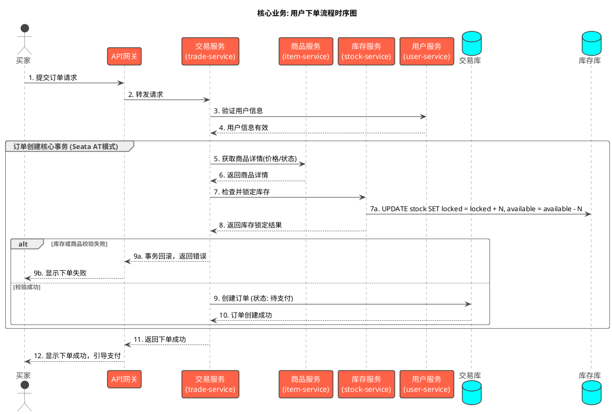

# 2. 业务流程细节

本章节深入分析电商平台的核心业务流程。为了更清晰、更有条理地展示各个模块的业务逻辑，详细内容已被拆分到独立的文档中。

请点击以下链接查看具体流程：

*   **[用户管理流程](./user_management.md)**
    *   描述了用户从注册、登录、认证到账户管理的完整生命周期。

*   **[商品管理流程](./product_management.md)**
    *   涵盖了商品的上架、信息修改、状态管理（上下架），以及后台的品牌和分类管理体系。

*   **[订单与支付流程](./order_process.md)**
    *   详细说明了用户从提交订单、库存锁定、创建订单到完成支付（包括余额支付和第三方支付）的完整闭环。

*   **[库存管理逻辑](./inventory_management.md)**
    *   详细介绍了库存的锁定、扣减、释放（如订单取消或支付超时）、以及补货等关键逻辑。

*   **[评价系统实现](./review_system.md)**
    *   说明了用户在订单完成后如何对商品进行评价和打分。

*   **[通知系统实现](./notification_system.md)**
    *   描述了系统如何通过邮件、短信或站内信等方式向用户发送重要通知（如订单状态变更、营销活动等）。

## 核心交互图

以下是整个电商平台最核心的 **"下单"** 业务时序图，展示了主要微服务之间的复杂协作关系。

*(注意: 上图引用自 `order_process_flow.puml`)* 