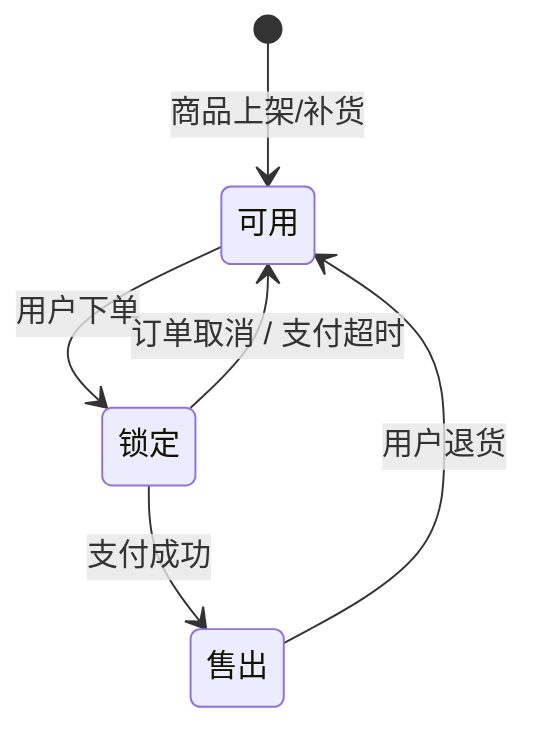
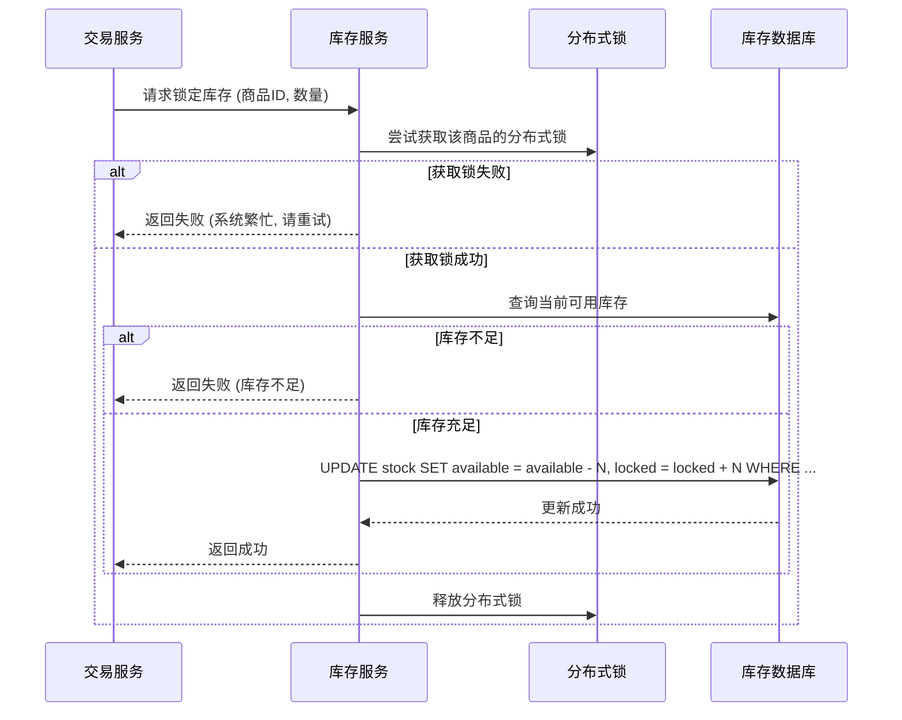
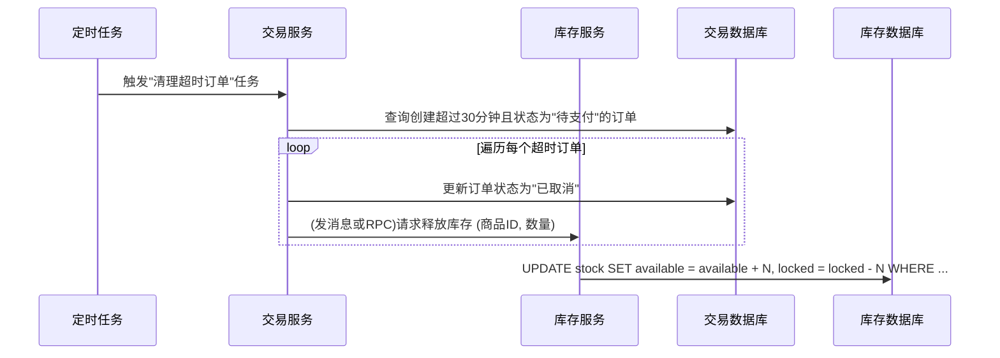

# 库存管理逻辑

库存管理是电商系统的核心之一，直接关系到商品的销售和用户体验。本部分详细描述库存的流转和一致性保证策略。

## 1. 库存核心概念

*   **物理库存:** 仓库中实际存在的商品数量。
*   **可用库存:** 可以供用户下单购买的库存数量。 `可用库存 = 物理库存 - 锁定库存`。
*   **锁定库存 (预留库存):** 用户下单但未支付时，为其预留的库存数量。这部分库存不能再被其他用户购买。

## 2. 库存流转状态机

库存的变化遵循一个明确的状态流转路径。

**状态流转说明:**
1.  **入库 (商品上架/补货):** 增加商品的物理库存和可用库存。
2.  **下单锁定:** 用户提交订单后，系统将从"可用库存"中划转相应数量到"锁定库存"。这是防止超卖的关键一步。
3.  **支付成功 (售出):** 用户完成支付后，"锁定库存"和"物理库存"都将正式扣减。
4.  **库存释放:**
    *   **订单取消:** 用户主动取消订单。
    *   **支付超时:** 用户在规定时间内未完成支付，系统自动取消订单。
    *   在以上两种情况下，被"锁定"的库存将被释放，重新变为"可用库存"。
5.  **退货入库:** 用户退货成功后，相应数量的库存会重新补充到"物理库存"和"可用库存"中。

## 3. 关键流程详解

### 3.1 库存锁定

这是最高频、最考验系统性能和一致性的环节。

### 3.2 库存释放

库存释放通常由定时任务或消息队列触发。

## 4. 库存一致性保障策略

为保证在高并发场景下库存数据的准确性，系统采用了多重策略：
*   **数据库层面:** 利用数据库事务和行级锁（如 `SELECT ... FOR UPDATE`）来保证单次操作的原子性。对于更新库存，使用 `UPDATE ... SET available = available - N WHERE available >= N` 这样的原子操作，避免"读-改-写"的竞态条件。
*   **分布式锁:** 对于涉及多个步骤的库存操作（如先读后写），使用Redis等分布式锁，确保同一时间只有一个线程能操作特定商品的库存。
*   **分布式事务:** 使用Seata的AT模式，将"创建订单"和"锁定库存"两个位于不同微服务中的操作绑定在同一个全局事务中。如果任一操作失败，两者都会回滚，保证了业务的最终一致性。 