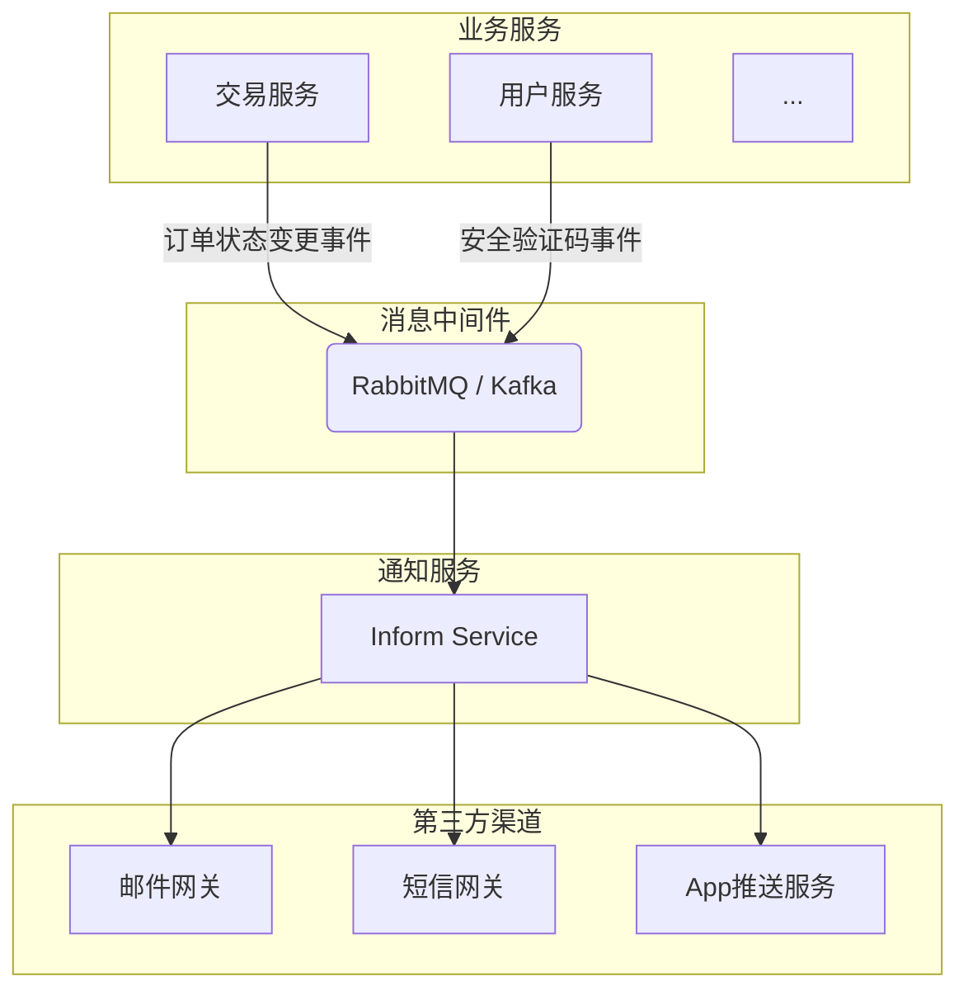
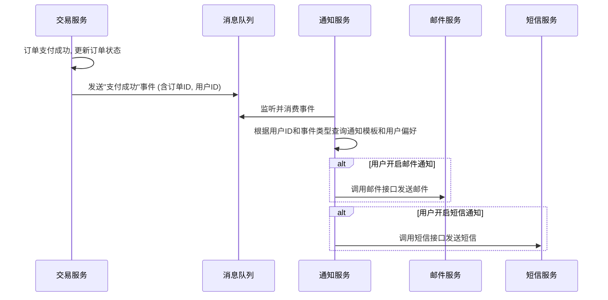

# 通知系统实现

通知系统用于在关键业务节点向用户发送必要的信息，是提升用户体验和保持用户粘性的重要工具。系统通常采用多种渠道结合的方式，并与其他业务服务解耦。

## 1. 系统架构

通知功能作为一个独立的微服务 (`inform-service`)，通过消息队列（如RabbitMQ）与上游的业务服务（交易服务、用户服务等）进行异步通信，从而实现解耦和削峰填谷。

## 2. 通知类型与触发场景

| 触发服务     | 业务场景         | 通知类型     | 渠道                     |
| :----------- | :--------------- | :----------- | :----------------------- |
| **交易服务** | 用户下单成功     | 订单确认通知 | 站内信、邮件             |
|              | 订单支付成功     | 支付成功通知 | 站内信、邮件、短信       |
|              | 商品已发货       | 发货提醒     | 站内信、邮件、App推送    |
|              | 订单即将超时     | 支付提醒     | 站内信                   |
|              | 订单退款成功     | 退款通知     | 站内信、短信             |
| **用户服务** | 用户注册成功     | 欢迎通知     | 邮件                     |
|              | 找回密码         | 验证码       | 邮件、短信               |
|              | 账户安全变更     | 安全提醒     | 邮件、短信               |
| **营销服务** | 优惠券到账       | 优惠券通知   | 站内信、App推送          |
|              | 活动开始提醒     | 活动通知     | 站内信、App推送          |

## 3. 实现流程

以"订单支付成功"为例：

**流程说明:**
1.  **事件发布:** 交易服务在确认支付成功后，向消息队列的指定主题（如 `trade.paid`) 发送一条消息，消息体包含订单号、用户ID、支付金额等关键信息。
2.  **事件消费:** 通知服务作为消费者，监听相应的主题。
3.  **模板与路由:** 收到消息后，通知服务会：
    *   根据事件类型（`trade.paid`）加载预设的通知模板（如"您的订单{orderId}已支付成功"）。
    *   根据用户ID查询用户的通知设置，确定需要通过哪些渠道（邮件、短信、站内信）发送。
4.  **发送执行:** 调用相应渠道的API（或SDK）发送通知。
5.  **状态记录:** 记录通知的发送状态（成功、失败、重试次数），便于后续跟踪和排查问题。对于失败的通知，可以配置重试机制。 