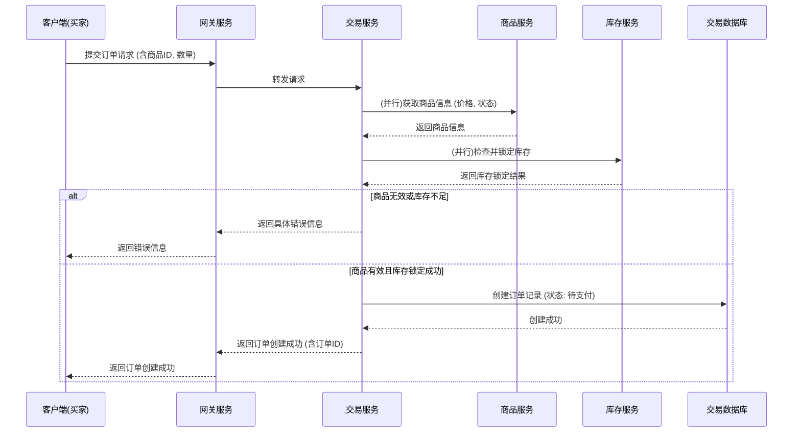
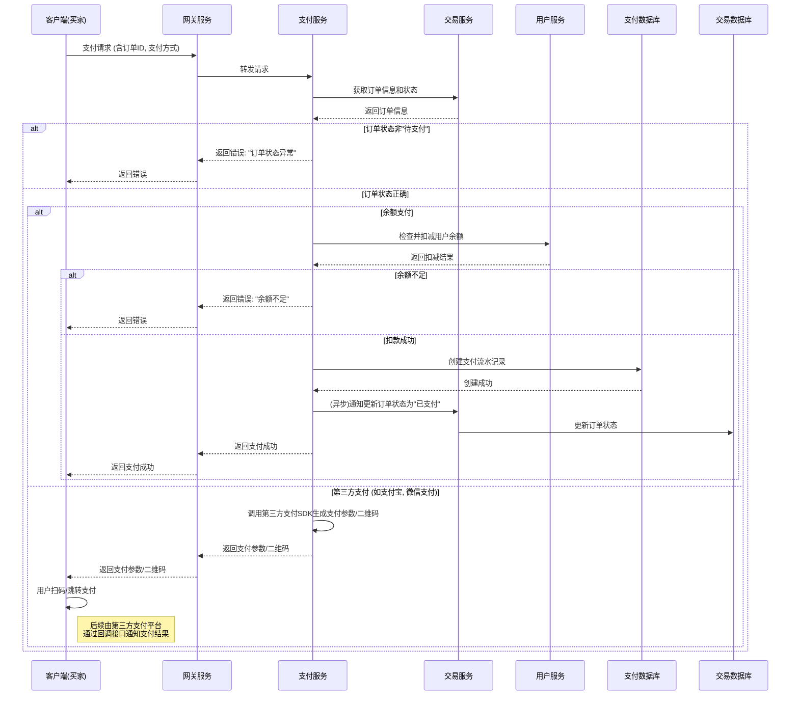

# 订单与支付流程

本部分详细描述了从用户下单到完成支付的整个核心交易闭环。

## 1. 下单流程

用户将商品加入购物车后，在结算页面提交订单。此流程涉及多个服务协作，需要保证数据的一致性。

**流程说明:**
1.  **请求发起:** 买家在客户端确认订单，请求中包含商品ID、购买数量、收货地址等信息。
2.  **服务路由:** API网关将请求转发至交易服务 (`trade-service`)。
3.  **前置校验:**
    *   **商品校验:** 交易服务调用商品服务 (`item-service`)，验证商品是否存在、是否处于可售状态。
    *   **库存校验:** 调用库存服务 (`stock-service`)，检查并尝试锁定所需数量的库存。这是一个关键步骤，通常使用分布式锁来防止超卖。
4.  **订单创建:** 所有校验通过且库存锁定成功后，交易服务在数据库中创建一条新的订单记录，初始状态为"待支付"。
5.  **响应返回:** 向客户端返回订单创建成功的消息，并附上订单ID，以便进行后续支付。
6.  **超时处理:** 系统通常会有一个定时任务，用于自动取消在一定时间内（如30分钟）未支付的订单，并释放锁定的库存。

## 2. 支付流程

用户在订单创建后，选择支付方式完成支付。

**流程说明:**
*   **内部支付 (余额支付):**
    1.  支付服务 (`pay-service`) 验证订单状态。
    2.  调用用户服务 (`user-service`) 检查并扣减用户账户余额。
    3.  扣款成功后，在支付数据库中创建一条支付流水记录。
    4.  通过消息队列或直接调用，异步通知交易服务将订单状态更新为"已支付"。
    5.  向客户端返回支付成功的结果。
*   **外部支付 (第三方支付):**
    1.  支付服务调用相应的第三方支付接口，生成支付凭证（如支付URL或二维码）。
    2.  将凭证返回给客户端，由客户端引导用户完成支付操作。
    3.  第三方支付平台在支付成功后，会通过一个预先配置好的回调URL通知支付服务。
    4.  支付服务在接收到回调通知后，执行与内部支付类似的后续步骤：创建支付流水、更新订单状态。 