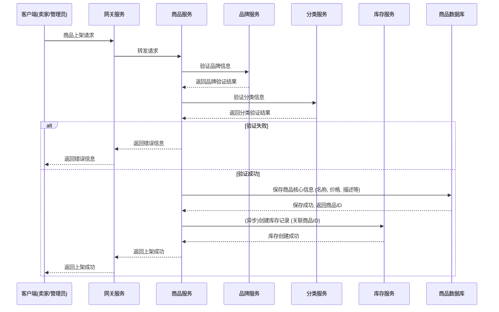
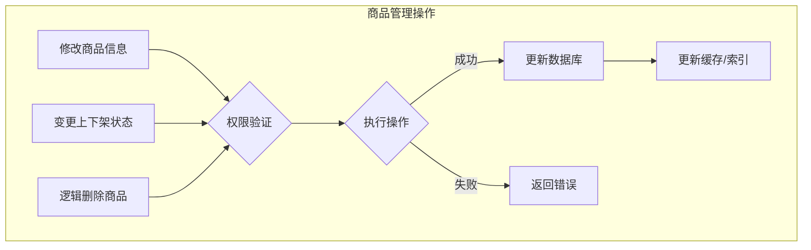

# 商品管理流程

本部分描述了与商品相关的业务流程，包括商品的上架、信息变更、状态管理以及品牌和分类的管理。

## 1. 商品上架流程

卖家或管理员通过客户端将新商品录入系统。

**流程说明:**
1.  **请求发起:** 卖家通过客户端提交商品上架请求，包含商品名称、价格、描述、图片、所属分类、品牌等信息。
2.  **服务路由:** API网关将请求转发至商品服务 (`item-service`)。
3.  **关联验证:** 商品服务会分别调用品牌服务 (`brand-service`) 和分类服务 (`category-service`) 来验证所提交的品牌和分类ID是否有效。
4.  **数据持久化:** 验证通过后，将商品的核心信息保存到数据库。
5.  **库存初始化:** 异步通知库存服务 (`stock-service`) 为新商品创建对应的库存记录，初始库存量通常为0或一个默认值。
6.  **响应返回:** 向客户端返回商品上架成功的结果。

## 2. 商品信息管理

商品管理包括对已上架商品的信息进行修改、变更上下架状态、以及逻辑删除。

**管理流程说明:**
*   **权限验证:** 所有商品管理操作都必须首先验证操作者的身份权限，确保只有商品的创建者或系统管理员才能进行修改。
*   **信息修改:** 允许修改商品的价格、描述、图片等非关键信息。
*   **状态变更:**
    *   **上架:** 商品变为可被搜索和购买的状态。
    *   **下架:** 商品不可被搜索和购买，但数据仍保留在系统中。
*   **逻辑删除:** 将商品标记为已删除状态，并非物理删除，以保留历史订单等关联数据。
*   **数据同步:** 商品信息发生变更后，需要及时更新相关的Redis缓存和（如果使用了）Elasticsearch等搜索引擎中的数据，以保证数据一致性。

## 3. 品牌与分类管理

品牌和分类是商品的重要属性，由管理员进行统一维护。

**流程说明:**
*   **创建(Create):** 管理员在后台系统中添加新的品牌或分类信息。
*   **读取(Read):** 系统提供列表查询和详情查询接口，供商品上架时选择，或供前端展示筛选条件。
*   **更新(Update):** 管理员可以修改已有品牌或分类的名称、Logo等信息。
*   **删除(Delete):** 当一个品牌或分类不再使用且没有商品关联时，可以将其删除。通常也采用逻辑删除。 