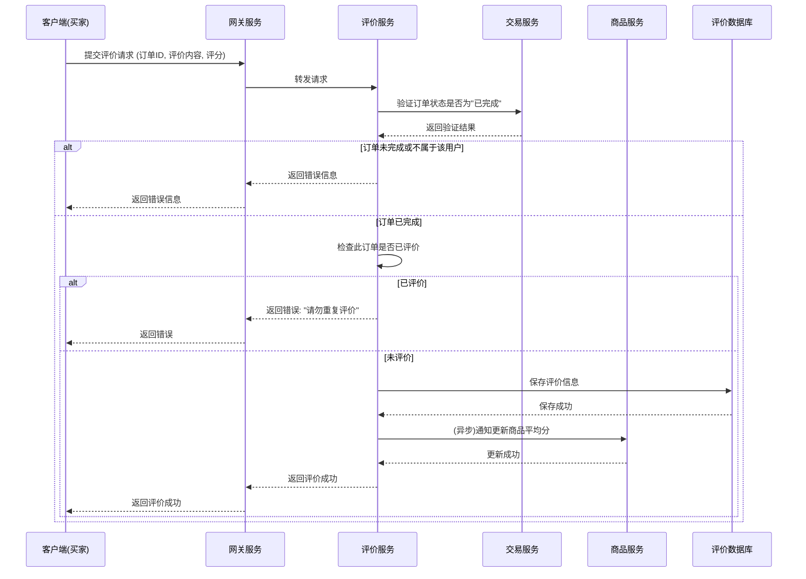

# 评价系统实现

评价系统是增强用户信任和商品反馈的重要环节。它允许购买过商品的用户分享他们的使用体验。

## 1. 评价流程

用户只能在订单完成后对已购买的商品进行评价。

**流程说明:**
1.  **请求发起:** 用户在客户端的"我的订单"页面，对已完成的订单发起评价请求，包含评分、文字评论、图片等信息。
2.  **前置校验:**
    *   评价服务 (`review-service`) 首先会调用交易服务 (`trade-service`)，验证该订单是否存在、是否属于当前用户、以及订单状态是否为"已完成"或"已收货"。
    *   同时，需要检查该订单是否已经被评价过，以防止重复提交。
3.  **数据持久化:** 校验通过后，将评价内容、评分、用户ID、商品ID等信息存入评价数据库。
4.  **数据聚合:** 评价提交后，通过消息队列或异步调用，通知商品服务 (`item-service`) 更新对应商品的累计评分和评价总数。这部分数据聚合可以方便商品列表页的展示，而无需每次都实时计算。
5.  **响应返回:** 向客户端返回评价成功的结果。

## 2. 评价的展示

商品的评价信息主要展示在商品详情页。

*   **总体评分:** 展示商品的平均分和评价总数。
*   **评价列表:** 分页展示所有用户的评价，通常按时间倒序排列。
*   **筛选和排序:** 提供按"好评"、"中评"、"差评"或"有图"等条件筛选的功能。

## 3. 追评与回复

*   **追加评价:** 允许用户在初次评价一段时间后（如确认收货后90天内）进行追加评价，分享更长期的使用体验。
*   **商家回复:** 允许卖家对用户的评价进行回复，增加互动性。商家回复需要经过审核，以防止不当言论。 