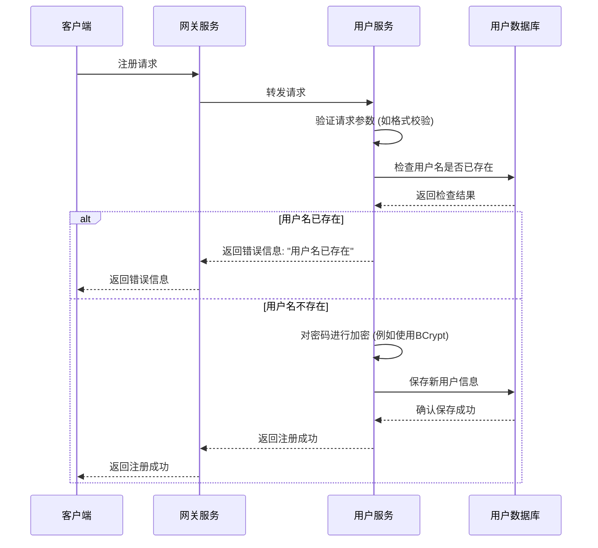
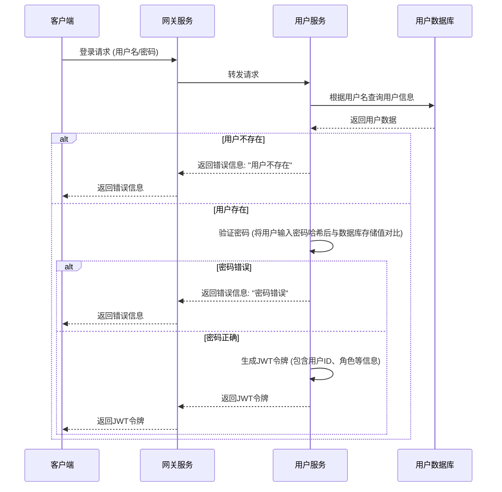

# 用户注册与认证流程

本部分详细描述了与用户账户相关的核心业务流程，包括新用户注册、用户登录认证，以及后续的账户管理。

## 1. 用户注册流程

新用户通过客户端提交注册信息，后端服务进行校验并创建账户。



**流程说明:**
1.  **请求发起:** 客户端发送包含用户名、密码、邮箱等信息的注册请求。
2.  **服务路由:** API网关接收请求并将其路由到用户服务 (`user-service`)。
3.  **参数校验:** 用户服务首先对请求参数的格式和有效性进行验证。
4.  **唯一性检查:** 查询数据库，确保用户名未被注册。
5.  **数据持久化:** 若用户名可用，对用户密码进行哈希加密，并将新用户信息存入数据库。
6.  **响应返回:** 向客户端返回注册成功或失败的结果。

## 2. 用户登录与认证流程

用户使用凭证进行登录，成功后系统返回JWT（JSON Web Token）用于后续的身份认证。



**流程说明:**
1.  **凭证提交:** 客户端发送包含用户名和密码的登录请求。
2.  **用户查询:** 用户服务根据用户名从数据库中检索用户信息。
3.  **密码验证:** 对用户提交的密码进行加密，并与数据库中存储的加密密码进行比对。
4.  **令牌生成:** 密码验证通过后，使用用户的核心信息（如用户ID、权限等）和预设的密钥生成一个JWT。
5.  **令牌下发:** 将生成的JWT令牌返回给客户端。客户端在后续的请求中，需在请求头（通常是 `Authorization` 字段）中携带此令牌以表明身份。

**JWT配置关键点:**
从 `user-service` 的配置中可以看到JWT的相关设置，如令牌的有效期、签名密钥等。
```yaml
hy:
  jwt:
    location: classpath:hmall.jks  # 密钥库位置
    alias: hmall                   # 密钥别名
    password: hmall123             # 密钥密码
    tokenTTL: 30d                  # 令牌有效期: 30天
``` 