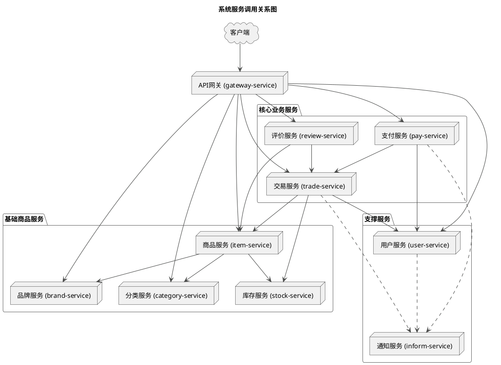

# 3. 微服务通信与协作

本章深入探讨了项目中微服务之间进行通信、协作和治理的机制。一个稳定且高效的微服务架构，离不开强大的服务注册发现、可靠的服务调用以及完善的服务治理策略。

详细内容已拆分到以下独立文档中：

*   **[Nacos: 服务注册、发现与配置中心](./nacos_usage.md)**
    *   详细解析了 Nacos 如何作为项目的神经中枢，管理所有服务的生命周期和外部化配置。

*   **[OpenFeign: 声明式服务调用](./openfeign_calls.md)**
    *   介绍了如何使用 OpenFeign 将远程 HTTP 调用简化为本地接口调用，并利用拦截器传递上下文。

*   **[服务治理：负载均衡、降级与容错](./service_governance.md)**
    *   集中讨论了保证系统稳定性的关键策略，包括客户端负载均衡和服务容错（熔断、限流）。

## 服务间调用关系图

下图直观地展示了系统主要微服务之间的静态调用依赖关系，有助于理解业务流程如何在不同的服务间流转。

*(注意: 上图是对 `service_dependency.puml` 文件的可视化呈现)* 