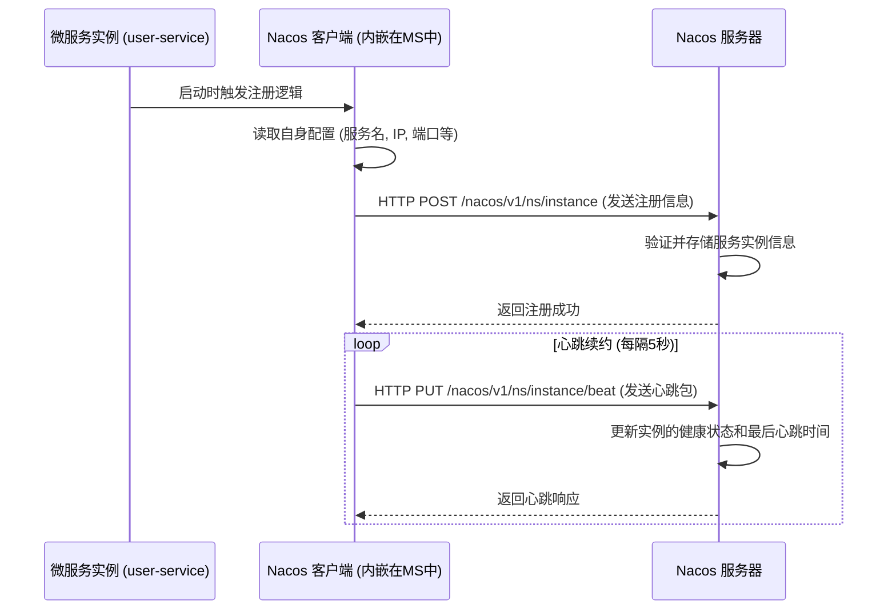
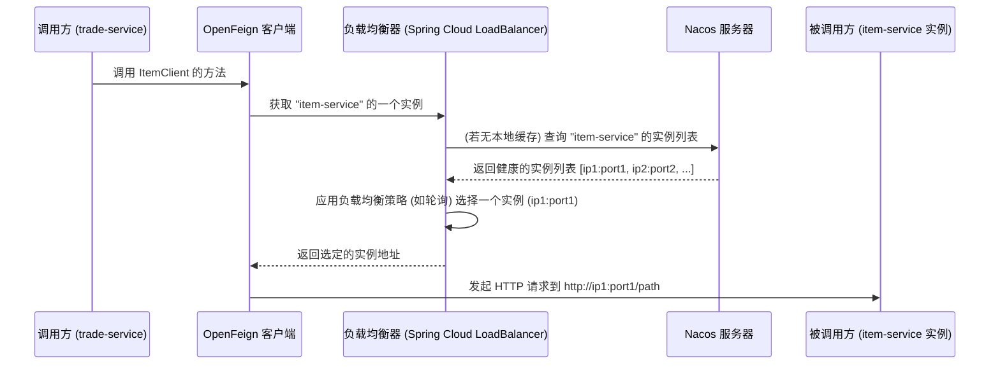

# Nacos: 服务注册、发现与配置中心

项目采用 Spring Cloud Alibaba 技术栈，其核心组件 Nacos 承担了两大职责：**服务注册与发现中心** 和 **统一配置中心**。

## 1. Nacos 作为服务注册与发现中心

### 1.1 服务注册流程

当任何一个微服务（如 `user-service`）启动时，它会自动向 Nacos 服务器注册自己的元数据。



**流程说明:**
*   **注册:** 服务启动时，内嵌的 Nacos 客户端将服务名 (`spring.application.name`)、IP、端口等信息封装后，通过HTTP请求发送给 Nacos 服务器。
*   **心跳:** 客户端会定期（默认5秒）向服务器发送心跳包，证明自己处于健康状态。
*   **健康检查:** Nacos 服务器会定期检查所有注册实例的心跳。如果一个实例在指定时间内（默认15秒）没有心跳，会被标记为不健康。如果持续不健康超过一定时间（默认30秒），该实例将被剔除。

### 1.2 服务发现流程

当一个服务（如 `trade-service`）需要调用另一个服务（如 `item-service`）时，它会通过 Nacos 来获取目标服务的地址列表。



**流程说明:**
*   **拉取:** Feign 客户端在发起调用前，会向负载均衡器请求一个可用的服务实例。
*   **缓存:** 负载均衡器客户端会从 Nacos 拉取服务列表并缓存在本地，同时通过心跳和Nacos推送来动态更新缓存，避免每次调用都请求 Nacos。
*   **负载均衡:** 从本地缓存的健康实例列表中，通过特定策略（默认为轮询）选择一个实例地址返回。

## 2. Nacos 作为统一配置中心

Nacos 也用于集中管理所有微服务的配置文件，实现配置的动态更新。

### 2.1 配置分析

在 `bootstrap.yaml` (或 `bootstrap.properties`) 文件中定义了 Nacos 配置中心的地址和规则。

```yaml
spring:
  cloud:
    nacos:
      server-addr: 192.168.163.11:8848 # Nacos服务器地址
      config:
        file-extension: yaml # 配置文件格式
        # 共享配置
        shared-configs:
          - data-id: shared-jdbc.yaml
          - data-id: shared-swagger.yaml
          - data-id: shared-log.yaml
          - data-id: shared-seata.yaml
        # 独有配置 (服务名-环境.后缀)
        # 例如: user-service-dev.yaml
```
**配置加载规则:**
服务启动时，Nacos 客户端会按顺序加载以下配置：
1.  **共享配置 (`shared-configs`):** 加载所有微服务通用的配置，如数据库连接、日志、Swagger等。
2.  **独有配置 (`spring.application.name`-`spring.profiles.active`.`file-extension`):** 加载当前服务自身特有的配置。
3.  **优先级:** 独有配置的优先级高于共享配置，即如果存在相同的配置项，以独有配置为准。

### 2.2 动态刷新

在需要动态刷新配置的 Bean 或类上添加 `@RefreshScope` 注解。当在 Nacos 控制台修改并发布配置后，Nacos 服务器会通知对应的客户端，客户端收到通知后会自动重新拉取配置，并刷新 `@RefreshScope` 标记的 Bean，使其在不重启服务的情况下应用新的配置。
