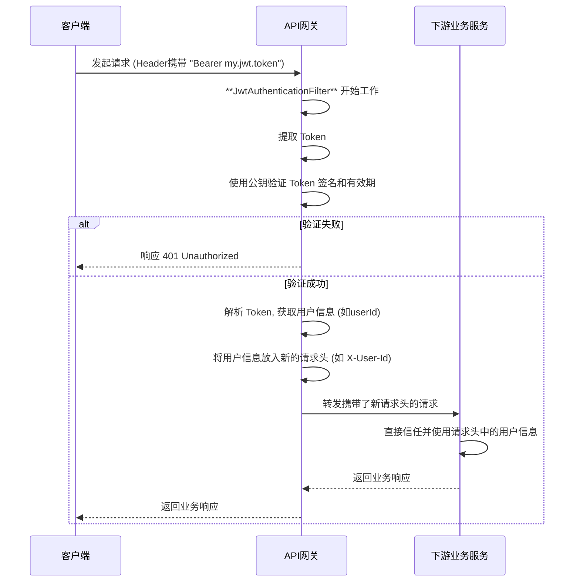

# JWT无状态认证机制

项目采用 JWT (JSON Web Token) 作为核心认证机制，以实现服务端无状态、可水平扩展的用户认证体系。客户端在登录成功后会获取一个JWT，并在后续所有需要认证的请求中携带它。

## 1. JWT 构成

JWT 本质上是一个由三部分组成的字符串，由 `.` 分隔：`Header.Payload.Signature`

*   **Header (头部):** 包含了令牌的元数据，主要是签名算法（如 `RS256`）和令牌类型（`JWT`）。
*   **Payload (载荷):** 存放了需要传递的数据，称为"声明(Claims)"。本项目中主要存放：
    *   `sub` (Subject): 令牌的主题，即用户名。
    *   `iat` (Issued At): 令牌的签发时间。
    *   `exp` (Expiration Time): 令牌的过期时间。
    *   `authorities`: 用户的权限列表（角色）。
*   **Signature (签名):** 对 `Header` 和 `Payload` 进行签名的结果，用于防止数据被篡改。签名需要使用服务端的私钥，只有持有私钥的服务端才能生成有效的签名。

## 2. JWT 的生成与校验

### 2.1 密钥配置

项目中使用 JKS (Java KeyStore) 文件来安全地存储非对称加密（RS256）的密钥对。配置指向该密钥库文件。

```yaml
# application.yml
hy:
  jwt:
    location: classpath:hmall.jks  # 密钥库文件位置
    alias: hmall                   # 密钥对的别名
    password: hmall123             # 密钥库密码
    tokenTTL: 30d                  # 令牌有效期，30天
```

### 2.2 令牌生成

当用户使用正确的用户名和密码请求登录接口时，认证成功后，`user-service` 会调用以下逻辑生成JWT。

```java
// JwtTokenProvider.java
public String createToken(UserDetails userDetails) {
    Date now = new Date();
    Date validity = new Date(now.getTime() + tokenTTL.toMillis());

    // 1. 创建Payload
    Claims claims = Jwts.claims().setSubject(userDetails.getUsername());
    claims.put("authorities", userDetails.getAuthorities().stream()
            .map(GrantedAuthority::getAuthority)
            .collect(Collectors.toList()));

    // 2. 使用私钥进行签名，并设置有效期
    return Jwts.builder()
            .setClaims(claims)
            .setIssuedAt(now)
            .setExpiration(validity)
            .signWith(privateKey, SignatureAlgorithm.RS256) // 使用RS256私钥签名
            .compact();
}
```

### 2.3 令牌校验

令牌的校验发生在 API 网关层，由一个全局的 `GatewayFilter` 完成。

```java
// JwtAuthenticationFilter.java
public GatewayFilter apply(Config config) {
    return (exchange, chain) -> {
        // ... (省略白名单等逻辑)

        // 1. 从请求头中提取令牌
        String token = extractToken(exchange.getRequest());
        if (token == null) {
            return onError(exchange, "缺少JWT令牌", HttpStatus.UNAUTHORIZED);
        }

        // 2. 验证令牌
        if (!jwtTokenProvider.validateToken(token)) {
            return onError(exchange, "无效的JWT令牌", HttpStatus.UNAUTHORIZED);
        }

        // 3. (可选) 将解析出的用户信息放入请求头，传递给下游服务
        String username = jwtTokenProvider.getUsername(token);
        ServerHttpRequest modifiedRequest = exchange.getRequest().mutate()
                .header("X-User-Name", username)
                .build();
        
        return chain.filter(exchange.mutate().request(modifiedRequest).build());
    };
}

// JwtTokenProvider.java
public boolean validateToken(String token) {
    try {
        // 使用公钥进行验签
        Jwts.parserBuilder().setSigningKey(publicKey).build().parseClaimsJws(token);
        return true;
    } catch (JwtException | IllegalArgumentException e) {
        log.error("JWT校验失败: {}", e.getMessage());
        return false;
    }
}
```

## 3. 网关统一认证流程

API 网关 (`gateway-service`) 是所有外部请求的入口，因此是执行统一认证的最佳位置。



这种模式的好处在于：
*   **职责单一:** 业务服务无需关心认证逻辑，只需专注于业务本身。
*   **安全性高:** 认证逻辑收口在网关，减少了攻击面。业务服务可以配置为只接受来自网关的内部调用。
*   **易于维护:** 认证逻辑只需在网关一处修改和维护。 