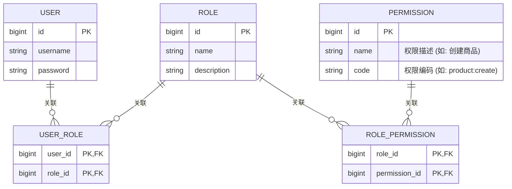

# RBAC授权与权限控制

认证（Authentication）解决了"你是谁"的问题，而授权（Authorization）则解决"你能做什么"的问题。本项目采用经典的 **RBAC (Role-Based Access Control, 基于角色的访问控制)** 模型来管理用户权限。

## 1. RBAC核心模型与表设计

RBAC的核心思想是，不直接将权限赋予用户，而是在用户和权限之间引入"角色"作为桥梁。
*   **用户 (User):** 系统的操作实体。
*   **角色 (Role):** 权限的集合，如"商品管理员"、"财务专员"、"普通用户"等。
*   **权限 (Permission):** 对特定资源执行特定操作的许可，如 `product:create` (创建商品)、`order:query` (查询订单) 等。

这种 **用户-角色-权限** 的关系，通过以下数据库表结构来实现：



*   `user_role` 是用户和角色的多对多关联表。
*   `role_permission` 是角色和权限的多对多关联表。

当需要判断一个用户是否有权执行某操作时，逻辑如下：
`用户 -> 多个角色 -> 多个权限集合`。只需检查用户的权限集合中是否包含目标操作所需的权限编码即可。

## 2. 权限校验实现

权限校验主要发生在服务端，通过 Spring Security 提供的注解在方法级别进行声明式控制。

### 2.1 启用方法级安全注解

在 Spring Security 的配置类 (`WebSecurityConfig`) 中，必须使用 `@EnableGlobalMethodSecurity` 注解来开启对方法级安全注解的支持。

```java
@Configuration
@EnableWebSecurity
@EnableGlobalMethodSecurity(prePostEnabled = true) // 开启 @PreAuthorize 和 @PostAuthorize 注解
public class WebSecurityConfig {
    // ... 其他配置
}
```

### 2.2 在业务代码中使用 `@PreAuthorize`

在 Controller 的方法上，可以使用 `@PreAuthorize` 注解来声明调用该方法所必须具备的权限。

```java
@RestController
@RequestMapping("/admin/products")
public class ProductAdminController {
    
    @Autowired
    private ProductService productService;
    
    // 只有拥有 'product:create' 权限的用户才能调用此方法
    @PostMapping
    @PreAuthorize("hasAuthority('product:create')")
    public Result<Void> createProduct(@RequestBody ProductDTO productDTO) {
        productService.createProduct(productDTO);
        return Result.success();
    }
    
    // 只有拥有 'product:update' 权限的用户才能调用此方法
    @PutMapping("/{id}")
    @PreAuthorize("hasAuthority('product:update')")
    public Result<Void> updateProduct(@PathVariable Long id, @RequestBody ProductDTO productDTO) {
        productService.updateProduct(id, productDTO);
        return Result.success();
    }
    
    // 可以组合多个权限要求
    @GetMapping("/{id}")
    @PreAuthorize("hasAuthority('product:read') or hasRole('ADMIN')")
    public Result<ProductDTO> getProduct(@PathVariable Long id) {
        return Result.success(productService.getProduct(id));
    }
}
```

**工作流程:**
1.  当一个经过JWT认证的请求到达被 `@PreAuthorize` 保护的方法时，Spring Security 的切面会介入。
2.  它会从 `SecurityContextHolder` 中获取当前用户的 `Authentication` 对象，该对象是在网关层解析JWT后填充的。
3.  从 `Authentication` 对象中获取用户的权限列表（即 `authorities`）。
4.  执行 `@PreAuthorize` 注解中的SpEL表达式（如 `hasAuthority('product:create')`），判断用户的权限列表是否满足表达式的要求。
5.  如果满足，则执行方法体；如果不满足，则直接抛出 `AccessDeniedException`，通常会向上层返回一个 `403 Forbidden` 的HTTP状态码。 