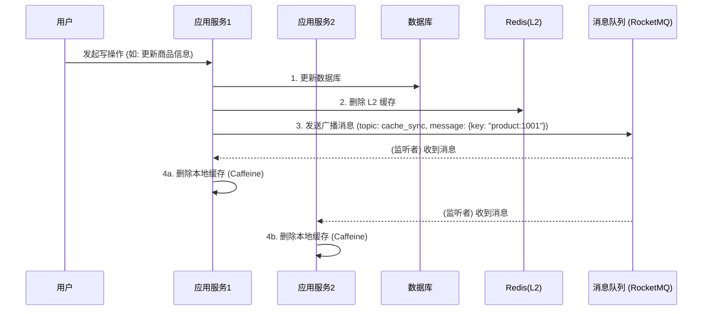

# 缓存高可用设计与异常处理

在构建了基础的缓存读写模式后，下一步是解决缓存本身的高可用问题，以及处理因缓存使用不当而引发的各种异常场景。

## 1. 多级缓存架构：提升性能与容灾

为了进一步提升性能并增加系统的弹性，项目采用了 **"L1 本地缓存 + L2 分布式缓存"** 的多级缓存架构。

*   **L1 本地缓存 (JVM 内存缓存):**
    *   **实现:** 使用 `Caffeine`，一个高性能的Java本地缓存库。
    *   **优点:** 访问速度极快，因为它就在应用进程的内存中，无任何网络开销。
    *   **缺点:** 容量受限于单机内存；多台服务器实例之间数据不共享，存在一致性问题。

*   **L2 分布式缓存:**
    *   **实现:** 使用 `Redis` 集群。
    *   **优点:** 容量大，所有服务实例共享同一份缓存数据。
    *   **缺点:** 存在网络IO开销，速度慢于本地缓存。

### 数据一致性保障

多级缓存的核心挑战在于如何保证 L1 本地缓存与 L2 分布式缓存之间的数据一致性。当数据更新时（通常是删除 L2 缓存），必须有一种机制来通知所有服务实例也删除它们各自的 L1 本地缓存。

本项目采用 **消息队列 (Message Queue)** 进行广播通知。



## 2. 经典缓存问题的解决方案

### 2.1 缓存穿透 (Cache Penetration)

**现象:** 恶意请求查询一个 **绝对不存在** 的数据，导致请求每次都会绕过缓存，直接打到数据库上，造成数据库压力。

**解决方案:**
1.  **接口层参数校验:** 在进入缓存查询逻辑前，对请求参数进行合法性校验。例如，ID不能为负数，不符合格式的UUID等。
2.  **缓存空对象 (Cache Nulls):** 当从数据库查询返回为空时，依然在缓存中存入一个特殊的"空对象"，并为其设置一个较短的过期时间（如1-5分钟）。
    ```java
    // ...查询数据库后
    if (data == null) {
        redisTemplate.opsForValue().set(key, NULL_VALUE, 5, TimeUnit.MINUTES);
        return null;
    }
    ```
3.  **布隆过滤器 (Bloom Filter):**
    *   **原理:** 一种空间效率极高的概率型数据结构，用于判断一个元素是否在一个集合中。它的特点是：**可能误判（false positive，认为存在但实际不存在），但绝不会漏判（false negative，认为不存在就一定不存在）**。
    *   **应用:** 在系统启动时，将所有可能存在的数据（如所有商品ID）加载到布隆过滤器中。当查询请求到来时，先问布隆过滤器：
        *   如果布隆过滤器说"不存在"，则直接返回，连Redis都不用查。
        *   如果布隆过滤器说"可能存在"，则继续走后续的缓存和数据库查询逻辑。

### 2.2 缓存击穿 (Cache Breakdown)

**现象:** 某一个 **热点Key** 在缓存中失效的瞬间，海量的并发请求同时涌入，访问这个刚刚失效的Key，导致这些请求全部穿透到数据库，造成数据库瞬间压力剧增。

**解决方案:** **分布式锁 + 双重检查**

使用分布式锁确保在同一时刻，只有一个线程能去数据库加载数据并写回缓存。其他线程则等待。

```java
// 基于Redisson的分布式锁实现
public Product getProductById(Long id) {
    String key = PRODUCT_CACHE_KEY_PREFIX + id;
    Product product = (Product) redisTemplate.opsForValue().get(key);

    if (product != null) {
        return product;
    }

    // 双重检查
    RLock lock = redissonClient.getLock("lock:product:" + id);
    try {
        lock.lock();
        // 再次检查缓存，因为在获取锁的过程中，可能已有其他线程写回了缓存
        product = (Product) redisTemplate.opsForValue().get(key);
        if (product != null) {
            return product;
        }

        // 只有一个线程能执行到这里
        product = productMapper.selectById(id);
        if (product != null) {
            redisTemplate.opsForValue().set(key, product, 30, TimeUnit.MINUTES);
        } else {
            // 防穿透
            redisTemplate.opsForValue().set(key, NULL_VALUE, 5, TimeUnit.MINUTES);
        }
    } finally {
        lock.unlock();
    }
    return product;
}
```

### 2.3 缓存雪崩 (Cache Avalanche)

**现象:** 大量的Key在 **几乎同一时刻** 集体失效，或者Redis实例本身发生宕机，导致海量请求在短时间内直接涌向数据库，如同"雪崩"一样压垮数据库。

**解决方案:**
1.  **过期时间加随机值:** 在设置缓存过期时间时，引入一个随机数，打乱集体失效的时间点。
    `expireTime = baseTime + random.nextInt(offsetTime);`
2.  **服务降级与熔断:** 当检测到数据库压力过大或Redis不可用时，通过 `Sentinel` 等熔断组件进行服务降级。例如，暂时关闭非核心功能，或者对于查询请求直接返回一个默认值或提示信息，保证核心服务的可用性。
3.  **Redis高可用部署:** 在生产环境中，必须搭建Redis的高可用架构，如 **哨兵模式 (Sentinel)** 或 **集群模式 (Cluster)**，确保当主节点宕机时，能够自动进行故障转移，保障缓存服务的持续可用。 