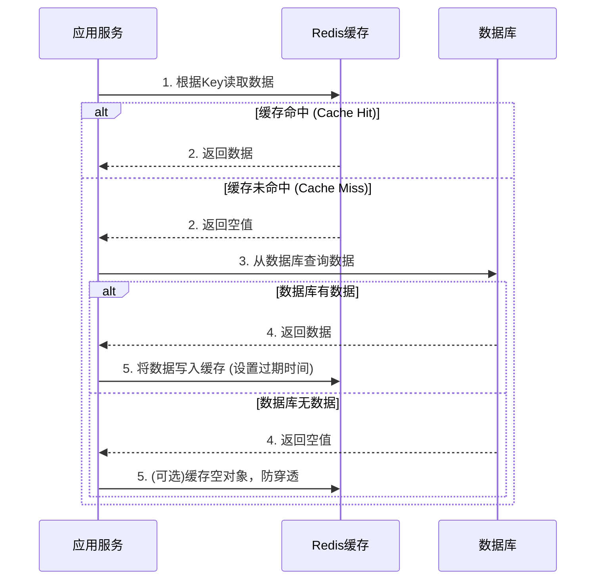

# Redis基础应用与核心模式

Redis 是本项目中性能优化的基石。它不仅仅是一个简单的键值存储，其丰富的数据结构和高性能特性使其在多个业务场景中都扮演了重要角色。

## 1. Redis 配置与核心应用

### 1.1 Lettuce连接池配置

项目使用 Lettuce 作为与 Redis 通信的客户端，并为其配置了连接池以提高性能和资源复用率。

```yaml
# application.yml
spring:
  data:
    redis:
      host: 192.168.163.11
      port: 6379
      database: 0
      lettuce:
        pool:
          max-active: 8      # 最大连接数
          max-wait: -1ms     # 连接等待时间，-1为不限制
          max-idle: 8        # 最大空闲连接
          min-idle: 0        # 最小空闲连接
```

### 1.2 主要应用场景

1.  **对象缓存 (String/Hash):** 这是最常见的用法。将数据库中的行记录（如商品信息、用户信息）序列化为JSON字符串或存储在Hash结构中，以Key-Value形式存入Redis。Key通常为 `业务前缀:主键ID`，例如 `product:1001`。
2.  **分布式会话 (String):** 利用 Spring Session Data Redis，将用户的会话信息存储在Redis中，解决了集群环境下Session共享的问题。
3.  **分布式锁 (String):** 利用 `SETNX` (SET if Not eXists) 命令的原子性，实现分布式锁，用于高并发场景下的资源同步。
4.  **排行榜 (Sorted Set):** 利用 `ZSET` 的有序性，轻松实现如"商品热销榜"、"用户积分榜"等功能。每个成员（member）都有一个分数（score），Redis会自动按分数排序。
5.  **计数器 (String):** 利用 `INCR` 命令的原子性，实现各种计数功能，如文章阅读数、商品点赞数、接口调用次数等，避免了并发下的数据不一致问题。
6.  **地理位置服务 (Geo):** 利用 `GEO` 相关命令（`GEOADD`, `GEORADIUS`），可以高效实现"附近的门店"、"附近的人"等LBS功能。

## 2. 旁路缓存模式 (Cache-Aside Pattern)

这是项目中最核心、最常用的缓存读写模式。它的核心思想是：**应用代码直接与"缓存"和"数据库"打交道，并由应用代码来维护两者的数据一致性。**

### 2.1 读操作 (Read-Aside)



### 2.2 写操作 (Write-Aside)

写操作的策略是保证数据一致性的关键。本项目采用 **"先更新数据库，再删除缓存"** 的策略。

**流程:**
1.  更新数据库中的数据。
2.  **直接删除** 缓存中对应的Key。

**为什么是删除缓存，而不是更新缓存？**
*   **懒加载思想:** 删除缓存后，该数据只有在下一次被 **实际需要** 时，才会通过读操作从数据库加载到缓存。如果直接更新缓存，但该数据后续很少被访问，这次更新就成了一次无效操作，浪费了系统资源（写放大）。
*   **并发一致性:** "先更新DB，再删缓存"是相对最能保证一致性的策略。虽然在极端的并发场景下（一个写操作刚删除缓存，另一个读操作在写操作commit前读到了旧数据并写回缓存），可能出现短暂的不一致，但这个概率非常低，且不一致的时间窗口极小。相比其他策略（如"先删缓存，再更新DB"），它的风险是最低的。

### 2.3 代码实现示例

```java
@Service
public class ProductServiceImpl implements ProductService {

    @Autowired
    private RedisTemplate<String, Object> redisTemplate;
    
    @Autowired
    private ProductMapper productMapper;

    private static final String PRODUCT_CACHE_KEY_PREFIX = "product:";

    // 读操作
    public Product getProductById(Long id) {
        String key = PRODUCT_CACHE_KEY_PREFIX + id;
        
        // 1. 从缓存读
        Product product = (Product) redisTemplate.opsForValue().get(key);
        
        if (product != null) {
            return product; // 缓存命中
        }
        
        // 2. 缓存未命中，从数据库读
        product = productMapper.selectById(id);
        
        if (product != null) {
            // 3. 写回缓存，并设置过期时间
            redisTemplate.opsForValue().set(key, product, 30, TimeUnit.MINUTES);
        }
        
        return product;
    }

    // 写操作
    public void updateProduct(Product product) {
        // 1. 先更新数据库
        productMapper.updateById(product);
        
        // 2. 再删除缓存
        String key = PRODUCT_CACHE_KEY_PREFIX + product.getId();
        redisTemplate.delete(key);
    }
} 