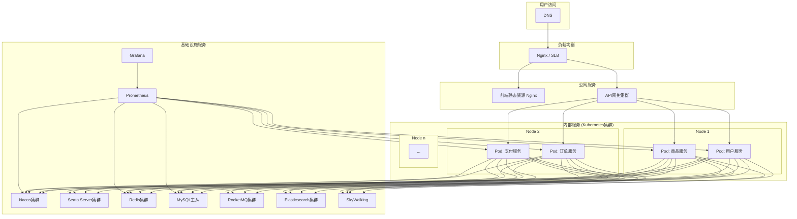

# 9. 部署与运维

## 9.1 概述

本章节将深入探讨电商平台项目的部署架构、CI/CD流程、监控与告警、日志管理以及容器化策略。一个稳定、高效的运维体系是保障线上服务质量的基石。

## 9.2 项目部署架构

项目采用基于容器的分布式部署架构，以实现高可用和弹性伸缩。


- **负载均衡**: 使用Nginx或云服务商的SLB作为流量入口，分发到前端和API网关。
- **前端部署**: 前端项目`e-business-front`打包成静态文件，由Nginx托管。
- **后端部署**: 所有后端微服务都被打包成Docker镜像，并通过Kubernetes（K8s）进行编排和管理。
- **基础设施**: 关键的中间件如Nacos、Redis、MySQL等都以高可用集群模式部署。

## 9.3 CI/CD流程 (持续集成/持续部署)

项目采用GitLab CI/CD来实现代码的自动化构建、测试和部署。

### 9.3.1 `.gitlab-ci.yml` 配置文件解析

```yaml
stages:
  - build
  - test
  - deploy

variables:
  MAVEN_OPTS: "-Dmaven.repo.local=.m2/repository"

# --- 后端CI/CD ---
build-backend:
  stage: build
  script:
    - mvn clean package -DskipTests
  artifacts:
    paths:
      - '**/target/*.jar'

test-backend:
  stage: test
  script:
    - mvn test

deploy-to-staging:
  stage: deploy
  script:
    - ./deploy.sh staging # 执行部署脚本到测试环境
  only:
    - develop # 只在develop分支触发

deploy-to-production:
  stage: deploy
  script:
    - ./build-docker-image.sh ${CI_COMMIT_TAG}
    - docker push registry.example.com/mall/${CI_PROJECT_NAME}:${CI_COMMIT_TAG}
    - ./update-k8s-deployment.sh ${CI_COMMIT_TAG}
  only:
    - tags # 只在打tag时触发生产部署
  when: manual # 需要手动确认

# --- 前端CI/CD ---
build-frontend:
  stage: build
  image: node:16
  script:
    - cd e-business-front
    - npm install
    - npm run build
  artifacts:
    paths:
      - e-business-front/dist/

deploy-frontend:
  stage: deploy
  script:
    - scp -r e-business-front/dist/* user@frontend-server:/var/www/html/
  only:
    - main
```
- **Stage**: 定义了`build`, `test`, `deploy`三个阶段。
- **后端流程**:
    - `build-backend`: 使用Maven打包所有Java服务。
    - `test-backend`: 运行单元测试。
    - `deploy-to-staging`: 自动部署`develop`分支的提交到测试环境。
    - `deploy-to-production`: 当开发者创建一个Git Tag时，触发生产环境部署流程，但需要手动点击确认，以防误操作。流程包括构建Docker镜像、推送到私有镜像仓库、更新K8s中的Deployment。
- **前端流程**:
    - `build-frontend`: 构建Vue项目。
    - `deploy-frontend`: 将打包好的静态文件`dist`部署到Nginx服务器。

## 9.4 监控与告警机制

项目构建了基于`Prometheus` + `Grafana` + `Alertmanager`的监控告警体系。

### 9.4.1 指标收集 (Prometheus)

- **微服务指标**: 通过`Spring Boot Actuator`和`micrometer-registry-prometheus`库暴露应用的健康状况、JVM信息、HTTP请求统计等指标。
- **中间件指标**: 使用官方或社区提供的Exporter来收集MySQL, Redis, Nacos, RocketMQ等的性能指标。
- **主机指标**: 使用`node-exporter`收集服务器的CPU、内存、磁盘、网络等指标。

### 9.4.2 指标可视化 (Grafana)

使用Grafana创建多个Dashboard，将收集到的指标进行可视化展示，方便实时观察系统状态。
- **服务概览Dashboard**: 展示所有微服务的QPS、延迟、错误率等核心指标。
- **JVM Dashboard**: 深入分析各个服务的JVM堆内存、GC情况、线程数等。
- **主机监控Dashboard**: 展示服务器资源使用情况。

### 9.4.3 告警 (Alertmanager)

在Prometheus中定义告警规则，当满足特定条件时（如CPU使用率过高、服务错误率激增、服务实例宕机），触发告警，由Alertmanager负责将告警信息通过不同渠道（如Email、钉钉、企业微信）发送给运维和开发人员。

**示例告警规则 (`alert.rules.yml`)**:
```yaml
groups:
- name: service_alerts
  rules:
  - alert: ServiceDown
    expr: up{job="micrometer"} == 0
    for: 1m
    labels:
      severity: critical
    annotations:
      summary: "Service {{ $labels.instance }} is down"
      description: "{{ $labels.job }} at {{ $labels.instance }} has been down for more than 1 minute."
```

## 9.5 日志收集与分析

采用`Elasticsearch` + `Logstash` + `Kibana` (ELK) 或 `Elasticsearch` + `Fluentd` + `Kibana` (EFK) 的方案进行日志的集中管理和分析。

### 9.5.1 日志流程

1.  **日志生成**: 微服务使用`Logback`或`Log4j2`将日志输出为JSON格式，并写入到文件中。
2.  **日志收集**: 在每个K8s Node上部署`Logstash`或`Fluentd`作为DaemonSet，负责收集节点上所有容器的日志文件。
3.  **日志处理与存储**: `Logstash`/`Fluentd`对日志进行解析、格式化，然后发送到Elasticsearch集群进行存储和索引。
4.  **日志查询与可视化**: 开发人员通过Kibana的Web界面，可以方便地进行全文检索、筛选、聚合分析所有服务的日志。

## 9.6 容器化与Kubernetes部署

### 9.6.1 Dockerfile

每个微服务都有一个`Dockerfile`用于构建其Docker镜像。

```Dockerfile
FROM openjdk:17-jdk-slim
ARG JAR_FILE=target/*.jar
COPY ${JAR_FILE} app.jar
ENTRYPOINT ["java","-jar","/app.jar"]
```

### 9.6.2 Kubernetes Manifests

使用K8s的`Deployment`和`Service`来管理应用的部署和访问。

**Deployment (`user-service-deployment.yaml`)**:
```yaml
apiVersion: apps/v1
kind: Deployment
metadata:
  name: user-service
spec:
  replicas: 3 # 部署3个副本
  selector:
    matchLabels:
      app: user-service
  template:
    metadata:
      labels:
        app: user-service
    spec:
      containers:
      - name: user-service
        image: registry.example.com/mall/user-service:v1.0.0
        ports:
        - containerPort: 8080
        resources: # 资源限制
          requests:
            cpu: "250m"
            memory: "512Mi"
          limits:
            cpu: "500m"
            memory: "1Gi"
        readinessProbe: # 就绪探针
          httpGet:
            path: /actuator/health/readiness
            port: 8080
          initialDelaySeconds: 20
          periodSeconds: 5
```
- **replicas**: 定义了副本数，K8s会自动保持这个数量。
- **resources**: 对容器的CPU和内存进行限制，避免资源滥用。
- **readinessProbe**: K8s通过健康检查来判断容器是否准备好接收流量。

**Service (`user-service-svc.yaml`)**:
```yaml
apiVersion: v1
kind: Service
metadata:
  name: user-service
spec:
  selector:
    app: user-service
  ports:
    - protocol: TCP
      port: 8080
      targetPort: 8080
  type: ClusterIP # 只在集群内部暴露
```

### 9.6.3 服务扩缩容

- **手动扩缩容**: `kubectl scale deployment user-service --replicas=5`
- **自动扩缩容 (HPA)**: 配置Horizontal Pod Autoscaler，根据CPU或内存使用率自动增减Pod数量。
    ```yaml
    apiVersion: autoscaling/v2
    kind: HorizontalPodAutoscaler
    metadata:
      name: user-service-hpa
    spec:
      scaleTargetRef:
        apiVersion: apps/v1
        kind: Deployment
        name: user-service
      minReplicas: 3
      maxReplicas: 10
      metrics:
      - type: Resource
        resource:
          name: cpu
          target:
            type: Utilization
            averageUtilization: 80
    ```

## 9.7 总结与建议

项目已经建立了一套现代化、自动化的运维体系，为系统的稳定运行提供了有力保障。

**建议**:
1.  **引入服务网格 (Service Mesh)**: 考虑引入`Istio`或`Linkerd`等服务网格，以声明式的方式实现更复杂的服务治理，如灰度发布、流量镜像、mTLS加密等。
2.  **混沌工程**: 定期进行混沌工程演练，主动注入故障（如杀死Pod、模拟网络延迟），以检验和提升系统的容错能力和弹性。
3.  **成本优化**: 深入分析云资源使用情况，利用K8s的自动扩缩容和云服务商的抢占式实例等策略来优化成本。
4.  **GitOps**: 采用`Argo CD`或`Flux`等工具，将Kubernetes的期望状态也通过Git进行版本控制，实现更可靠、可追溯的部署。 