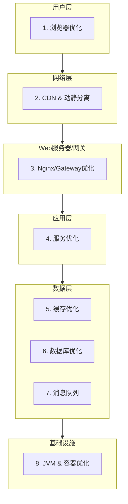

# 10. 性能优化

## 10.1 概述

本章节将系统性地分析电商平台的性能瓶颈，并提出一套从前端到后端、从应用到基础设施的全方位优化策略。性能优化是一个持续的过程，旨在提升用户体验、增加系统吞吐量并降低资源成本。

## 10.2 系统瓶颈分析

通过压力测试和线上监控，识别出系统的潜在瓶颈主要集中在以下几个方面：
1.  **数据库访问**: 高并发下的复杂查询、慢SQL、锁竞争是主要的数据库瓶颈。
2.  **库存扣减**: 秒杀等场景下，库存服务的并发更新压力巨大。
3.  **首页和商品详情页**: 作为访问量最大的页面，其加载速度直接影响用户转化率。
4.  **API网关**: 所有流量的入口，其处理能力和延迟是关键。
5.  **JVM**: 不合理的JVM参数配置可能导致频繁的Full GC，造成服务卡顿。

## 10.3 全链路优化策略图

## 10.4 优化策略详解

### 10.4.1 前端性能优化

-   **静态资源优化**:
    -   **CDN加速**: 将JS、CSS、图片等静态资源部署到CDN，利用其边缘节点为用户提供最近访问，降低延迟。
    -   **资源压缩与合并**: 使用Vite/Webpack等构建工具对资源进行压缩（Terser for JS, CSSNano for CSS）和合并，减少HTTP请求数。
    -   **图片优化**: 使用WebP格式，对图片进行懒加载和响应式处理。
-   **渲染优化**:
    -   **路由懒加载**: 按需加载页面组件。
    -   **服务端渲染(SSR)**: 对SEO要求高且内容相对静态的页面（如商品详情页）采用SSR，加快首屏渲染速度。
    -   **虚拟滚动**: 对于长列表（如订单历史、商品列表），采用虚拟滚动技术，只渲染视口内的数据。

### 10.4.2 数据库查询性能优化

-   **SQL优化**:
    -   **慢查询日志**: 定期分析MySQL的慢查询日志，找出性能低下的SQL。
    -   **索引优化**: 使用`EXPLAIN`分析SQL执行计划，确保查询能够命中合适的索引。避免索引失效的情况（如在索引列上使用函数、`LIKE`以`%`开头等）。
    -   **避免大事务**: 将长事务拆分为多个小事务，减少锁的持有时间。
    -   **读写分离**: 引入主从复制架构，将读请求分发到从库，降低主库的压力。
-   **分库分表**:
    -   **垂直拆分**: 将不同业务模块的表拆分到不同的数据库中（如用户库、商品库、订单库）。
    -   **水平拆分**: 对于单表数据量巨大的表（如订单表），根据用户ID或时间进行分片。

### 10.4.3 高并发优化

-   **缓存**: 充分利用本地缓存（Caffeine）和分布式缓存（Redis）来扛住读请求的高并发。详情见"缓存策略"章节。
-   **异步化**:
    -   **消息队列**: 将非核心、耗时的操作（如发送邮件/短信、更新用户积分、记录日志）通过RocketMQ进行异步处理。
    -   **CompletableFuture**: 在Java代码中，使用`CompletableFuture`对多个独立的后端调用进行并行化处理，减少总的响应时间。
-   **限流与降级**:
    -   在API网关和业务服务层都设置限流规则，防止突发流量冲垮系统。
    -   对非核心功能（如商品推荐、用户评价）进行降级处理，在系统高负载时，可以暂时关闭或返回兜底数据，保证核心交易流程的稳定。
-   **库存扣减优化**:
    -   **Redis预减库存**: 下单时，在Redis中进行库存预扣减，利用其原子操作保证并发安全。订单超时未支付或取消时，再将库存加回。
    -   **分段锁/乐观锁**: 避免对整个库存记录加锁，可以使用分段锁思想，或在数据库层面使用`UPDATE stock SET quantity = quantity - 1 WHERE id = ? AND quantity > 0`的乐观锁方式。

### 10.4.4 JVM调优策略

-   **选择合适的垃圾收集器**:
    -   根据服务的特性选择合适的GC。对于低延迟要求的API服务，可以选用G1或ZGC。
-   **设置合理的堆大小**:
    -   通过压力测试和性能监控，为每个服务设置合适的初始堆大小(`-Xms`)和最大堆大小(`-Xmx`)。通常将两者设置为相等，以避免堆的动态伸缩带来的性能开销。
-   **监控GC日志**:
    -   开启GC日志，并使用`GCEasy`等工具进行分析，观察Full GC的频率和耗时，找出导致Full GC的原因（如内存泄漏、堆设置不合理）。
-   **Metaspace/PermGen**:
    -   对于Java 8及以后的版本，关注Metaspace的使用情况，防止其耗尽导致Full GC。

### 10.4.5 基础设施优化

-   **连接池配置**:
    -   合理配置数据库连接池（HikariCP）和Redis连接池（Lettuce）的大小，避免在高并发下因获取不到连接而导致请求阻塞。
-   - **容器资源配置**:
    -   根据服务的实际资源使用情况，在Kubernetes中为其分配合理的CPU和内存`requests`和`limits`，实现资源的有效利用。

## 10.5 性能测试

-   **基准测试**: 对核心接口和业务流程进行基准测试，获取其在不同并发水平下的TPS、响应时间等数据。
-   **压力测试**: 持续增加并发用户数，直到系统出现拐点或崩溃，找到系统的最大容量和瓶颈所在。
-   **稳定性测试**: 在系统高负载下长时间运行，观察系统是否存在内存泄漏、连接池耗尽等问题。
-   **测试工具**: 使用`JMeter`, `Gatling`, `nGrinder`等工具进行性能测试。

## 10.6 总结

性能优化是一个综合性的工程，需要从多个层面协同进行。核心思想是"减少计算、减少I/O、空间换时间"。通过建立完善的监控和测试体系，持续不断地发现瓶颈并进行针对性优化，是保障系统高性能、高可用的关键。 