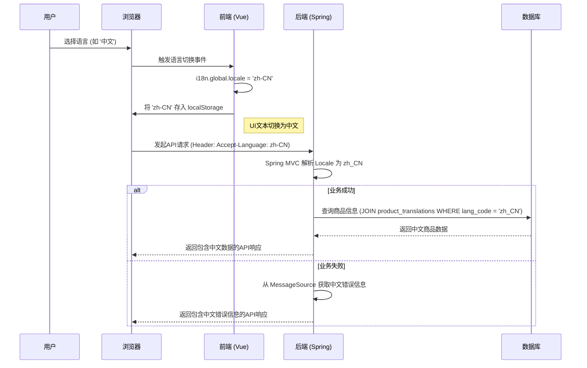

# 14. 国际化与本地化 (i18n & l10n)

本文档深入分析了本电商平台在国际化（Internationalization, i18n）和本地化（Localization, l10n）方面的技术实现方案。一个优秀的国际化架构是平台走向全球市场的基石。

## 1. 总体设计原则

项目采用前后端分离的国际化策略：

-   **前端 (Vue)**: 负责处理界面UI相关的文本、日期、数字和货币格式化。
-   **后端 (Spring Boot)**: 负责处理业务逻辑相关的文本（如错误消息、通知邮件）和存储多语言内容（如商品名称、描述）。
-   **数据驱动**: 国际化资源（翻译文本）存储在独立的资源文件中，而非硬编码在代码里，便于维护和新增语言。

## 2. 前端实现 (Vue 3 + vue-i18n)

前端使用 `vue-i18n` 库作为核心解决方案。

### 2.1. 资源文件结构

国际化文本资源按语言存放在 `src/locales/` 目录下。

```bash
src/
└── locales/
    ├── en.json
    ├── zh-CN.json
    └── ja.json
```

**`en.json` 示例:**

```json
{
  "nav": {
    "home": "Home",
    "products": "Products"
  },
  "buttons": {
    "addToCart": "Add to Cart",
    "checkout": "Checkout"
  }
}
```

### 2.2. `vue-i18n` 初始化

在 `src/main.ts` 中对 `vue-i18n` 进行初始化，并加载默认语言（例如，从浏览器设置或用户偏好中获取）。

```typescript
// src/plugins/i18n.ts
import { createI18n } from 'vue-i18n';
import en from '@/locales/en.json';
import zhCN from '@/locales/zh-CN.json';

const i18n = createI18n({
  legacy: false, // 使用 Composition API 模式
  locale: localStorage.getItem('lang') || 'zh-CN', // 默认语言
  fallbackLocale: 'en', // 回退语言
  messages: {
    'en': en,
    'zh-CN': zhCN
  }
});

export default i18n;
```

### 2.3. 在组件中使用

在Vue组件中，通过 `useI18n` 钩子来访问翻译函数 `t()`。

```vue
<template>
  <nav>
    <a href="/">{{ t('nav.home') }}</a>
    <a href="/products">{{ t('nav.products') }}</a>
  </nav>
  <button>{{ t('buttons.addToCart') }}</button>
</template>

<script setup>
import { useI18n } from 'vue-i18n';
const { t } = useI18n();
</script>
```

### 2.4. 语言切换

通过修改 `i18n.global.locale` 的值来实现全局语言切换，并将用户的选择持久化到 `localStorage`。

## 3. 后端实现 (Spring Boot)

后端利用 Spring Framework 内建的 `MessageSource` 机制来处理国际化。

### 3.1. 资源文件结构

资源文件遵循 `messages_xx_XX.properties` 的命名约定，存放在 `src/main/resources/` 下。

```bash
src/main/resources/
├── messages.properties       (默认)
├── messages_en_US.properties
└── messages_zh_CN.properties
```

**`messages_zh_CN.properties` 示例:**

```properties
error.product.notFound=产品不存在
email.order.confirm.subject=您的订单 [#{orderId}] 已确认
```

### 3.2. 配置 `MessageSource`

Spring Boot 会自动配置一个 `MessageSource` Bean，我们只需提供资源文件即可。可以通过 `Accept-Language` 请求头来动态解析地域。

```java
@RestController
public class DemoController {

    @Autowired
    private MessageSource messageSource;

    @GetMapping("/hello")
    public String hello(Locale locale) {
        // locale 会由 Spring 根据 Accept-Language 请求头自动注入
        return messageSource.getMessage("greeting", null, "Default Greeting", locale);
    }
}
```

对于业务错误提示，通常会在全局异常处理器中根据 `Locale` 返回对应的多语言错误信息。

## 4. 业务数据国际化

对于需要多语言内容的业务数据（如商品名称、商品详情），数据库设计是关键。

### 4.1. 数据库表设计

采用"附加语言表"的模式，将多语言内容存储在一个单独的表中。

**`products` (主表)**
| id | price | sku |
|----|-------|-----|
| 1  | 99.99 | P001|

**`product_translations` (翻译表)**
| id | product_id | lang_code | name | description |
|----|------------|-----------|------|-------------|
| 1  | 1          | en_US     | Laptop | High performance laptop... |
| 2  | 1          | zh_CN     | 笔记本电脑 | 高性能笔记本电脑... |

这种设计的优点是：
-   主表结构干净。
-   易于扩展新的语言，只需在翻译表中增加记录。
-   查询时，可以通过 `JOIN` 操作根据当前语言环境获取对应的内容。

## 5. 本地化 (l10n)

本地化不仅仅是翻译，还包括对特定地域格式的适配。

-   **货币**: 前端使用 `Intl.NumberFormat` API 的 `style: 'currency'` 来格式化货币，确保显示正确的货币符号和格式。
-   **日期与时间**: 使用 `Intl.DateTimeFormat` API 或 `date-fns`/`dayjs` 等库来处理跨时区的日期和时间显示。
-   **数字**: `Intl.NumberFormat` 同样可以用来格式化数字（如千位分隔符）。

## 6. Mermaid 图示：国际化流程


