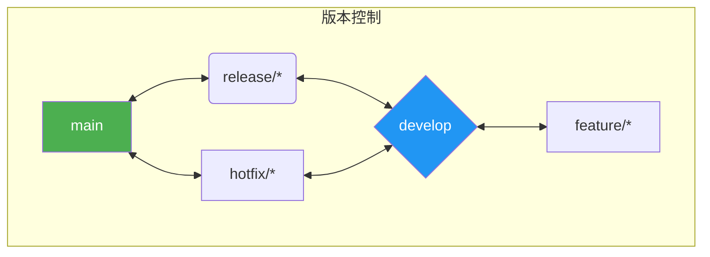

# 15. 文档与规范

本章节详细阐述了项目为确保代码质量、提升协作效率和保障系统可维护性而制定的一系列文档与开发规范。

## 1. 文档策略

-   **API 文档**:
    -   **后端**: 使用 SpringDoc (集成了 OpenAPI 3) 自动生成 API 文档。开发者在 Controller 层通过注解（如 `@Operation`, `@Parameter`）来丰富文档内容。
    -   **访问**: 在开发和测试环境中，可以通过 `/swagger-ui.html` 访问交互式的 API 文档。
-   **架构文档**: 存储在 `docs/` 目录中，由一系列 Markdown 文件和 PlantUML/Mermaid 图表组成（即本项目已完成的文档）。这部分文档会随着架构演进持续更新。
-   **代码注释**:
    -   **Java**: 对所有 public 方法和复杂业务逻辑块，必须添加 Javadoc 注释，说明其功能、参数、返回值和异常。
    -   **Vue**: 对可复用的组件，必须有 props 和 events 的清晰说明。对复杂的 hook 或 store a ction，需要添加注释。
-   **README.md**: 每个微服务模块根目录下都有一个 `README.md`，内容包括：
    -   模块简介与核心职责。
    -   如何本地启动（环境配置、依赖服务等）。
    -   关键配置项说明。
    -   API 端点列表（可链接到 Swagger）。

## 2. 开发规范

### 2.1. 编码规范

-   **后端 (Java/Spring)**:
    -   遵循 [Google Java Style Guide](https://google.github.io/styleguide/javaguide.html)。
    -   使用 Checkstyle 和 PMD 插件进行静态代码检查，确保风格统一和代码质量。
    -   **命名**: 服务接口以 `Service` 结尾，实现类以 `ServiceImpl` 结尾。
    -   **异常处理**: 统一在 `GlobalExceptionHandler` 中处理，返回标准化的错误响应体。禁止随意 `try-catch` 吞掉异常。
    -   **DTOs**: Controller 层与服务层之间、服务层与外部调用之间，必须通过 DTOs (Data Transfer Objects) 进行数据传输，严禁实体类 (Entity) "越界"。
-   **前端 (Vue/TypeScript)**:
    -   遵循 [Vue 官方风格指南](https://v3.cn.vuejs.org/style-guide/)。
    -   使用 ESLint 和 Prettier 进行代码格式化和质量检查。
    -   **组件命名**: 使用 `PascalCase`，且名称应与其功能紧密相关。
    -   **状态管理**: Pinia store 的 action 必须是异步的，修改 state 必须通过 action 进行。

### 2.2. 代码质量管理

-   **静态分析**: CI/CD 流水线中集成了 SonarQube，每次代码提交都会触发一次扫描。
-   **代码审查 (Code Review)**:
    -   所有 `feature` 分支合入 `develop` 分支前，必须由至少一名其他团队成员进行 Code Review。
    -   审查重点：业务逻辑正确性、代码可读性、是否遵循规范、是否存在潜在性能问题。
-   **测试覆盖率**: SonarQube 会监控单元测试覆盖率，目标是核心业务模块的行覆盖率不低于 80%。

## 3. 版本控制与发布流程

项目采用 **GitFlow** 作为版本控制的工作流模型。

### 3.1. 分支模型

-   `main`: 主分支，存放最稳定的、可随时发布到生产环境的代码。只有 `release` 分支可以合入。
-   `develop`: 开发分支，是所有新功能开发的集成基础分支。
-   `feature/*`: 功能分支，从 `develop` 分支切出，用于开发新功能。完成后合入 `develop`。
    -   命名规范: `feature/TICKET-123-add-user-login`
-   `release/*`: 发布分支，从 `develop` 分支切出，用于准备发布新版本（版本号更新、最后的 bug 修复）。完成后同时合入 `main` 和 `develop`。
-   `hotfix/*`: 热修复分支，从 `main` 分支切出，用于紧急修复生产环境的 bug。完成后同时合入 `main` 和 `develop`。

### 3.2. 发布流程

1.  从 `develop` 创建 `release/v1.2.0` 分支。
2.  在发布分支上进行最后的测试和 bug 修复，并更新版本号。
3.  将 `release/v1.2.0` 合并到 `main` 分支，并打上 `v1.2.0` 的 tag。
4.  触发 CI/CD 流程，从 `main` 分支构建并部署到生产环境。
5.  将 `release/v1.2.0` 合并回 `develop` 分支，确保 `develop` 也包含了最新的修复。

## 4. API 设计规范

-   **RESTful 风格**: API 设计遵循 RESTful 原则。
-   **版本控制**: API 版本通过 URL 路径体现，如 `/api/v1/users`。
-   **命名**:
    -   URL 路径使用小写字母和连字符 `-`。
    -   路径中的名词表示资源，应使用复数形式，如 `/users`, `/products`。
-   **HTTP 方法**:
    -   `GET`: 查询资源。
    -   `POST`: 创建资源。
    -   `PUT`: 全量更新资源。
    -   `PATCH`: 部分更新资源。
    -   `DELETE`: 删除资源。
-   **响应体格式**: 所有响应都包装在一个标准结构体中。

    **成功响应 (`2xx`)**:
    ```json
    {
      "code": 200,
      "success": true,
      "message": "OK",
      "data": { ... } // 业务数据
    }
    ```

    **失败响应 (`4xx`, `5xx`)**:
    ```json
    {
      "code": 404,
      "success": false,
      "message": "User not found",
      "data": null
    }
    ```

## 5. 图示：Git 工作流

