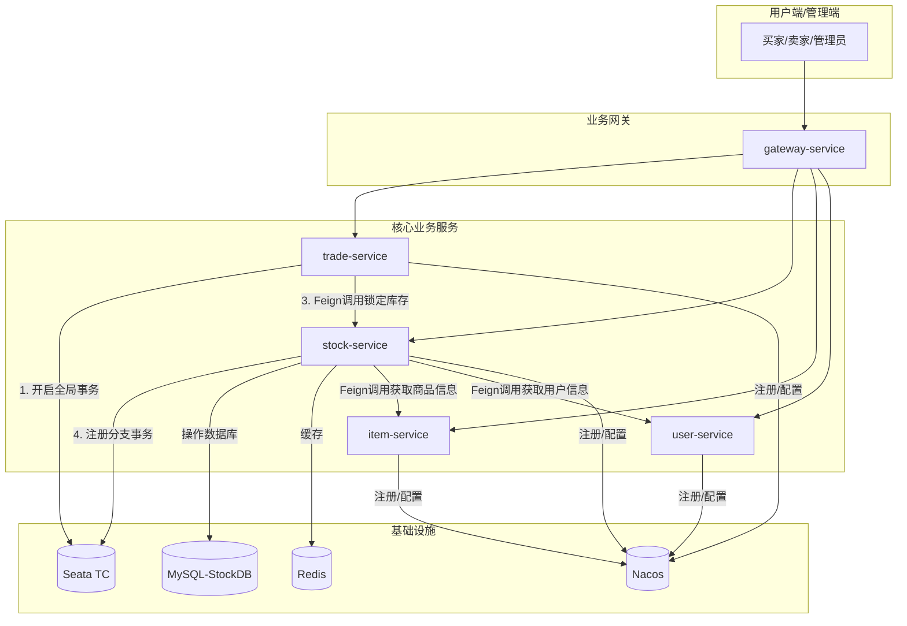
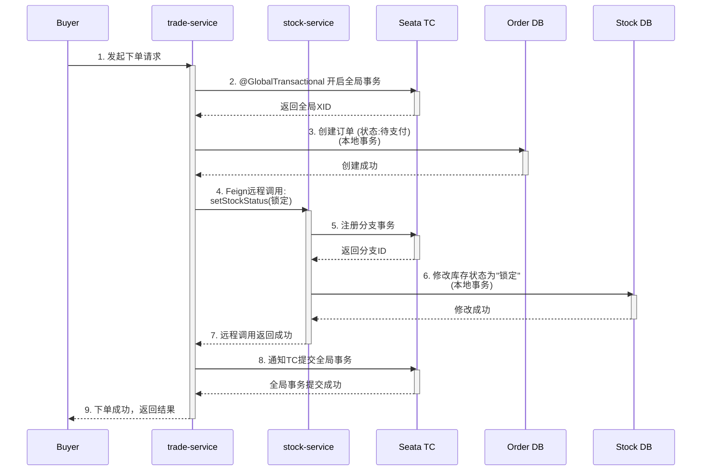
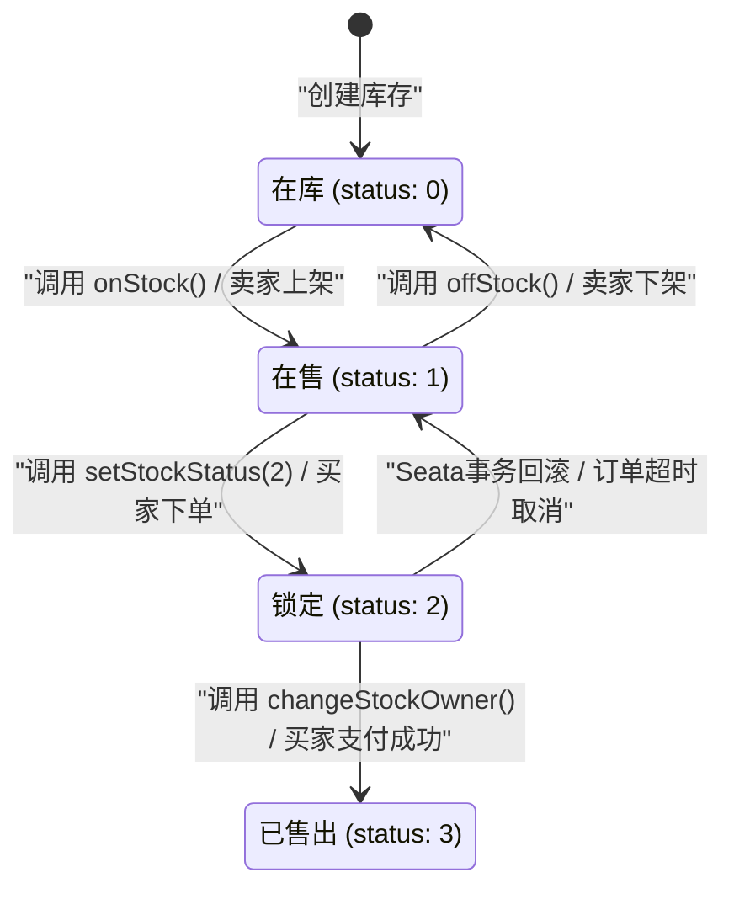

### **电商项目 - 库存服务 (stock-service) 模块答辩文档**

#### **1. 模块职责与定位 (我是谁？我做什么？)**

*   **一句话定位:** 库存服务是电商平台的核心后台服务之一，**它负责管理平台所有商品的库存信息、状态和归属**，是保证交易流程正常进行的基础。

*   **核心职责:**
    1.  **库存管理:** 提供对商品库存的增、删、改、查等基础维护功能，主要供后台管理系统使用。
    2.  **库存状态流转:** 管理库存从"在库"到"上架"、"锁定"、"已售出"等一系列状态的变更，是交易流程中的关键环节。
    3.  **库存查询:** 向前台应用（如商品详情页）和内部服务（如交易服务）提供实时、准确的可用库存数据查询。
    4.  **分布式事务协调:** 作为分布式事务的重要参与方，与交易服务等模块配合，通过 **Seata** 框架保证在下单、支付等复杂场景下，库存扣减与订单创建的数据强一致性。
    5.  **所有权变更:** 在交易成功后，负责将库存的所有权从卖家转移给买家。

#### **2. 核心业务流程详解 (我是如何工作的？)**

这是您答辩的重点，需要把故事讲清楚。

**场景一：卖家发布商品（库存上架）**

1.  卖家在前端页点击"上架"按钮。
2.  前端调用 `UserStockUserController` 的 `POST /user/stock/stock-user/on-stock` 接口。
3.  `StockUserServiceImpl` 的 `onStock` 方法被调用。
4.  该方法将对应的库存记录 `status` 字段从 `0` (在库) 修改为 `1` (在售/上架)，并设置价格。
5.  此时，商品库存变为"可用库存"，可以在商品列表或详情页被买家看到。

**场景二：买家下单 (分布式事务下的库存锁定)**

这是最核心的流程，一定要讲清楚 **Seata** 的作用！

1.  **交易服务开启全局事务**: 用户在 `trade-service` (交易服务) 点击"下单"按钮，`trade-service` 会通过 Seata 的 `@GlobalTransactional` 注解开启一个**全局分布式事务**。
2.  **交易服务创建订单**: `trade-service` 在自己的数据库中创建一条订单记录，状态为"待支付"。
3.  **交易服务远程调用库存服务**: `trade-service` 通过 Feign 远程调用 `stock-service` 的 `PUT /user/stock/stock-user/setStockStatus/{id}?status=2` 接口，请求将商品库存状态从 `1` (在售) 修改为 `2` (锁定)。
4.  **库存服务执行本地事务**:
    *   `stock-service` 接收到请求，Seata 的事务协调器 (TC) 会记录这个分支事务。
    *   `StockUserServiceImpl` 的 `setStockStatus` 方法执行 SQL `UPDATE` 语句，修改库存状态。这个操作在 `stock-service` 自己的本地事务中执行。
    *   如果执行成功，本地事务提交，并向 TC 报告分支事务成功。
    *   如果执行失败（例如，数据库异常），本地事务回滚，并向 TC 报告分支事务失败。
5.  **全局事务提交或回滚**:
    *   **全部成功**: 如果 `trade-service` 的本地操作和 `stock-service` 的远程调用都成功，Seata TC 会通知所有参与者，**全局事务提交**。库存最终被锁定。
    *   **任何一步失败**: 假如 `stock-service` 的 `setStockStatus` 因为网络问题或数据库问题失败了，它会回滚自己的操作并通知 TC。TC 随后会通知 `trade-service` **回滚**它之前创建的订单操作。
    *   **最终效果**: **保证了"订单创建"和"库存锁定"这两个跨库、跨服务的操作要么同时成功，要么同时失败，数据绝对不会不一致**（不会出现订单创建了但库存没锁住，导致超卖的情况）。

**场景三：买家支付成功 (库存所有权转移)**

1.  支付成功后，`trade-service` (或 `pay-service`) 会调用 `stock-service` 的 `PUT /user/stock/stock-user/changeStockOwner/{id}?userId={buyerId}` 接口。
2.  `StockUserServiceImpl` 的 `changeStockOwner` 方法被调用，将库存记录的 `user_id` 从卖家 ID 修改为买家 ID。
3.  同时，可能会再次调用 `setStockStatus` 将状态更新为 `3` (已售出)。
4.  至此，整个交易流程中的库存环节结束。

#### **3. 技术栈与架构解析 (我用了什么神兵利器？)**

*   **开发框架:** `Spring Boot` + `Spring Web MVC`，业界主流，快速开发。
*   **持久层:**
    *   `MyBatis-Plus`: 简化了对数据库的 CRUD 操作，效率高。
    *   `MySQL`: 核心业务数据的关系型存储。
    *   `Druid`: 高性能数据库连接池，提供强大的监控功能。
*   **服务治理与配置:**
    *   `Nacos`: 作为**服务注册与发现中心**和**配置中心**。服务启动后会注册到 Nacos，并从 Nacos 拉取数据库连接、日志级别等配置，实现了配置的动态刷新和服务的统一管理。
*   **服务间通信:**
    *   `Feign`: 以声明式、接口化的方式优雅地实现了服务间的 RESTful API 调用。例如，库存服务通过 `ItemClient` 获取商品信息，通过 `UserClient` 获取用户信息。
*   **分布式事务:**
    *   `Seata`: **核心技术**。解决了微服务架构下，跨多个数据库和服务的业务操作（如下单-扣库存）的数据一致性问题，采用 AT (自动补偿) 模式，对业务代码无侵入。
*   **缓存:**
    *   `Redis` (在配置文件中出现): 虽然在核心代码中未直接体现，但配置中出现了 Redis。可以推测其用途是**缓存热点商品的库存数量** (`getAvailableStock` 的结果)，以降低数据库的查询压力，提升系统性能。

#### **4. 架构与流程图表**

**4.1. 系统架构总览图**

此图展示了库存服务 (`stock-service`) 在整个电商平台微服务架构中的位置和作用。

**4.2. "买家下单" 分布式事务时序图**

此图详细揭示了在"买家下单"场景下，库存服务如何参与 Seata 分布式事务，保证数据一致性。

**4.3. 库存状态流转图**

此图描述了库存记录在其生命周期内可能经历的各种状态及其转换路径。

#### **5. 深入分析：易混淆点解析**

在代码审查过程中，我们发现了一些可能在答辩中被问到的易混淆点，提前进行梳理有助于您更从容地应对。

**核心混淆点：三种不同的"增加库存"接口**

项目中有三个接口都可以"增加库存"，但它们的职责和使用场景完全不同，甚至存在设计上的冗余。

1.  **后台管理员接口: `POST /admin/stock`**
    *   **控制器方法:** `AdminStockUserController.addStockUser(StockUser stockUser)`
    *   **业务逻辑:** 直接、无条件地向数据库 `stock_user` 表中插入一条新的库存记录。
    *   **使用场景:** **后台管理**。用于系统管理员初始化商品库存，或进行手动的数据修复和录入。

2.  **用户操作接口: `POST /user/stock/stock-user/add`**
    *   **控制器方法:** `UserStockUserController.addStock(StockUser stockUser)`
    *   **业务逻辑:** **智能判断**。该方法会先检查当前用户 (`userId`) 是否已经拥有该商品 (`itemId`) 的库存记录。
        *   **如果存在**，则在原记录上增加数量 (`quantity`)。
        *   **如果不存在**，则创建一条新的库存记录。
    *   **使用场景:** **前台用户**。例如，在一个C2C（用户对用户）交易平台，用户通过某种活动（如购买、交易获得）得到一件商品时，调用此接口计入其个人名下的库存。这是最主要的、给普通用户使用的增加库存接口。

3.  **冗余的用户接口: `PUT /user/stock/stock-user/add`**
    *   **控制器方法:** `UserStockUserController.addStock1(...)`
    *   **业务逻辑:** 直接调用 `stockUserMapper.addStock(...)`，功能相对简单，可能只是单纯增加数量。
    *   **使用场景:** **疑似冗余或废弃接口**。从其命名 (`addStock11`) 和不一致的接口设计 (`PUT` + `RequestParam`) 来看，这很可能是开发过程中的遗留代码，或为某个特定场景开发的临时接口。它的功能与第二个接口高度重合，存在技术债。
    *   **答辩策略:** 如果被问到，可以坦诚地指出这是一个设计上可以优化的地方，它的功能可以被第二个接口完全覆盖和替代。这能体现出您对代码的深入思考和批判性眼光。

**服务调用澄清**

*   **`ItemClient`**: 库存服务本身不存储商品的名称、图片等详细信息，只存储 `itemId`。当需要向前端展示完整的库存信息时，它会通过 `ItemClient` **远程调用** `item-service` (商品服务) 来获取这些展示性的数据。
*   **`UserClient`**: 类似地，当需要展示库存所有者的昵称、头像等信息时，它会通过 `UserClient` **远程调用** `user-service` (用户服务) 来获取用户信息。
*   **`BrandClient`**: 用于获取品牌的额外信息（如等级），是对库存展示信息的补充。

通过这样的梳理，我们可以清晰地看到，`stock-service` 严格遵守了微服务的"单一职责原则"，只关心库存的核心数据（谁的、什么东西、有多少、什么状态），而将其他关联信息交由专门的服务去管理。

#### **6. API 接口清单**

*   **后台管理接口 (`/admin/stock`)**
    *   `POST /`: 新增库存
    *   `PUT /`: 修改库存
    *   `GET /{id}`: 查询单个库存
    *   `DELETE /{id}`: 删除库存
    *   `DELETE /batch`: 批量删除
    *   `GET /page`: 分页查询
    *   `GET /total`: 查询总库存
*   **前台/内部服务接口 (`/user/stock/stock-user`)**
    *   `GET /available`: **(核心)** 查询可用库存
    *   `POST /on-stock`: 上架
    *   `POST /off-stock/{id}`: 下架
    *   `PUT /setStockStatus/{id}`: **(核心)** 设置库存状态（用于事务中的库存锁定）
    *   `PUT /changeStockOwner/{id}`: **(核心)** 变更库存所有者（用于交易完成）
    *   `GET /{id}`: 根据商品ID查库存详情

#### **7. 答辩讲述思路建议**

1.  **开场白:** "评委老师好，我负责的是电商项目中的库存服务模块。这个服务是整个电商交易流程的核心与基石，它主要负责管理商品的库存，并确保在分布式高并发环境下交易数据的一致性。"
2.  **职责与架构:** 结合【模块职责与定位】和【系统架构总览图】进行介绍，让评委对模块的定位有一个宏观的认识。
3.  **技术栈展示:** 结合【技术栈与架构解析】进行介绍。"为了实现这个服务，我们采用了一系列主流技术栈，比如基于 Spring Boot 构建，使用 Nacos 作为注册和配置中心，服务间通过 Feign 调用，并通过 MyBatis-Plus 和 MySQL 进行持久化..."
4.  **核心流程串讲 (重点！):** "接下来，我将通过'用户下单'这个最核心的场景，并结合这张【时序图】和【状态图】，来详细阐述库存服务是如何工作的。" 然后，声情并茂地讲述【核心业务流程详解】中的**场景二**，指着图讲解，一定要把 **Seata 如何保证"订单创建"和"库存锁定"原子性**的过程讲清楚，这是你最大的亮点！
5.  **其他流程补充:** 简单介绍一下上架、支付成功后的流程，以展示你对整个业务全貌的理解。
6.  **总结:** "总而言之，库存服务通过清晰的职责划分、可靠的技术选型，特别是利用 Seata 解决了分布式事务这一核心痛点，为整个电商平台的稳定、可靠运行提供了有力保障。我的介绍到此结束，谢谢各位老师。" 